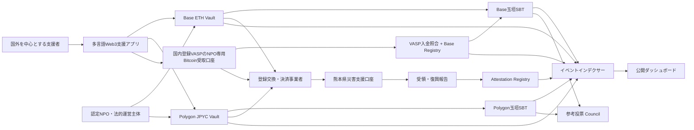
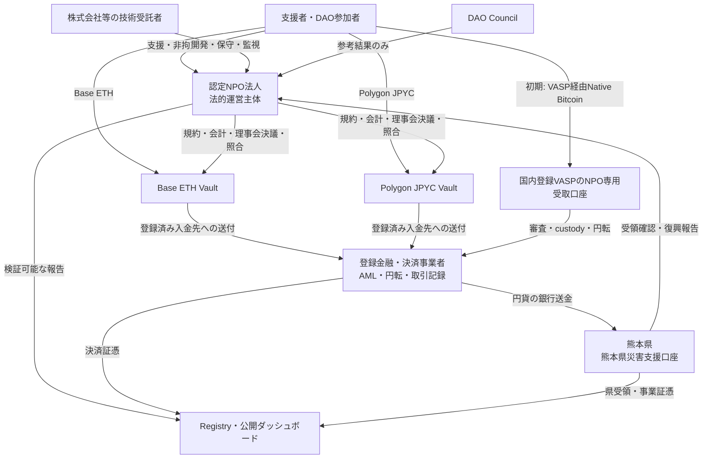
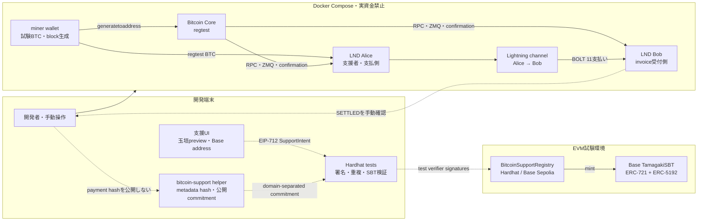
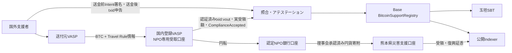
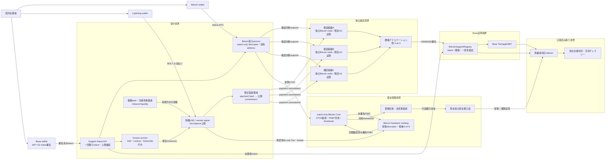
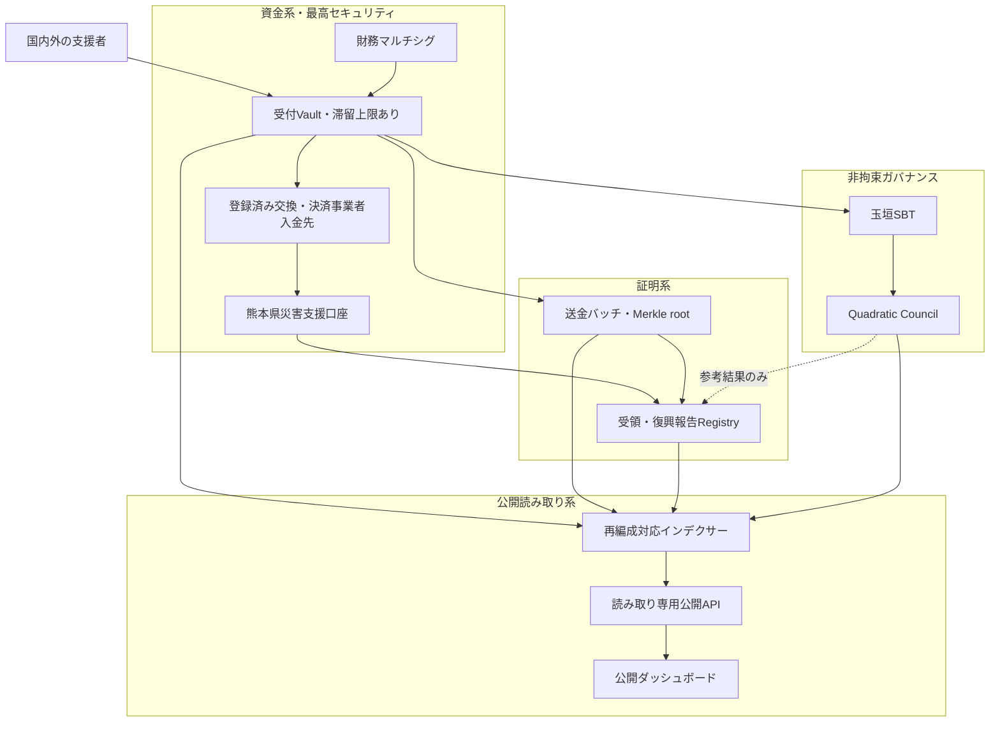
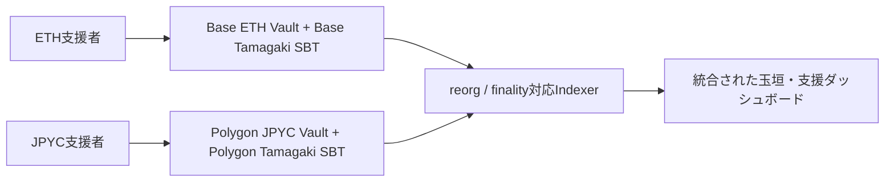
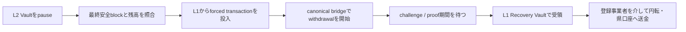

# 2. システム構造

## 全体構成

初期本番のBitcoin経路では、認定NPO自身のBitcoin address、LND、hardware multisigを使用せず、国内登録VASPのNPO専用受取口座を入口とします。VASPが受領、Travel Rule、AML／CFT・制裁審査、custody、円転を担当し、本システムは公開可能な入金結果だけを受けて集計とSBT発行を行います。Lightningと自己管理walletからの直接入金は後続段階です。

## 認定NPOを中心とする共同運営

本番候補では、災害救援・復興支援を定款に持ち、情報公開と監査体制を備えた**既存の認定NPO法人**を法的運営主体とします。認定NPOがすべての機能を自ら行うのではなく、規制金融機能、技術運用、行政判断、支援者参加を別主体へ分離します。この構成は提案であり、特定のNPO、熊本県、JPYCまたは金融事業者との提携・承認を示しません。

資金の法的帰属は利用規約、会計、コントラクトで一致させます。支援成立時に資産が認定NPOへ確定的に帰属し、支援者別残高、交換、振替、任意返金を提供しない「NPOへの支援」として設計します。認定NPOは登録事業者を介して自己資産を円転し、円貨を熊本県へ別個に寄附します。「支援者が熊本県へ直接JPYCを送る」とは表示しません。県が将来公式な収納スキームを採用した場合は、登録事業者から県への直接収納モデルへADRを更新します。

| 主体 | 法的・運用上の責務 | 持たせない権限 |
|---|---|---|
| 認定NPO法人 | 規約、寄附成立、会計、理事会決議、契約、照合、問い合わせ、公開報告 | 利用者向け交換業、単独鍵による送金、県予算の決定 |
| 登録金融・決済事業者 | 必要な登録範囲でのETH・JPYC・BTC円転、AML/CFT、制裁対応、銀行送金、取引証憑 | 復興目的、DAO投票、NPOの事業判断 |
| 株式会社等の技術受託者 | コントラクト、インデクサー、UI、監視の開発・保守 | 支援金の所有、Vaultの単独管理、任意の手数料控除 |
| 熊本県 | 円貨の受納、受領確認、復興事業と支出結果の報告 | NPOまたはDAOの未承認操作、Councilによる行政判断の拘束 |
| DAO Council | 非拘束の参考投票、改善提案、公開検証 | 資金移動、円転、法人・行政の法定意思決定 |

認定NPOであることだけで資金決済法上の登録が不要になるわけではありません。他人のための電子決済手段の管理・媒介に該当しないかを専門家と当局へ事前確認し、該当する金融機能は登録事業者へ委ねます。詳細は[ADR-0008](./adr/0008-certified-npo-joint-operation)を参照してください。

## オンチェーン構成

| コントラクト | 責務 | 資金移動権限 |
|---|---|---|
| Base `RecoverySupportVault` | chain ID `8453`、`NativeOnly`でETH受付・集約送金 | 登録済み交換・決済事業者入金先へのみ |
| Polygon `RecoverySupportVault` | chain ID `137`、`ERC20Only`で公式JPYC受付・集約送金 | 登録済み交換・決済事業者入金先へのみ |
| Base `BitcoinSupportRegistry` | Bitcoin outpoint／Lightning payment commitmentの閾値アテステーションと重複防止 | なし |
| chain別`TamagakiSBT` | ERC-721 + ERC-5192型の譲渡不能証明 | なし |
| `RecoveryAttestationRegistry` | 県受領証跡と復興報告ハッシュ | なし |
| `RecoverySupportCouncil` | SBT保有者の非拘束投票 | なし |

## オフチェーン構成

- チェーンイベントを再編成に耐えて同期するインデクサー
- 初期Bitcoin用のVASP認証済み入金明細取得・`txid:vout`照合・閾値アテステーションservice。固有addressを導出する分離wallet基盤、独立Bitcoin node、Lightning nodeは将来の直接受領経路でだけ追加
- 国別・時間別・資産別の公開集計API
- 任意公開名、国、メッセージを管理する撤回可能なデータストア
- 銀行証憑・県受領確認書・復興報告書を保管する文書基盤
- 熊本県または委任先が復興報告を入力する管理インターフェース

これは本番系の原則です。画像付きSBTのSepoliaデモでは、明示的同意を得た任意表示名とメッセージをSBTのオンチェーンSVGへ直接格納する経路も検証します。この経路のデータは撤回できないため、本番採用は別途判断します。

### BitcoinとBaseの境界

Native BTCはEVM Vaultへbridgeしません。初期本番では、支援者が送金前に予定額、Base address、玉垣hash、nonceだけを署名し、未知のtxidを含めません。送金後、検証者が国内登録VASPの認証済み入金明細とpublic chainを突合し、`txid:vout`、実受領額、confirmation、Intent hashをAttestationへ拘束します。`ComplianceAccepted`後にBase Registryへ登録し、指定Base addressへERC-721＋ERC-5192玉垣SBTを発行します。Travel RuleのPII、VASP認証情報、Bitcoin private keyを公開系へ渡しません。

## Bitcoin・LNDデモ系の構成

デモ系は実資金を使わず、リポジトリの`docker/bitcoin-lnd/compose.yml`でBitcoin `regtest`と2台のLND nodeを起動して支払いを再現します。`miner` walletは試験資金とblock生成だけに使用し、Aliceを支援者、Bobを受付nodeとしてchannel開設、BOLT 11 invoice、`SETTLED`確認までを検証します。Base側はHardhatまたはBase Sepoliaの`BitcoinSupportRegistry`で支援Intent、閾値署名、重複防止、玉垣SBT発行を検証します。Composeからsettlement購読、検証者、Registry送信、Indexerまでの端間自動化はまだ同梱していません。操作手順は[ローカルLightningデモ環境](./lightning-demo)に記載します。

実線は現在ローカルで操作できるBitcoin／Lightning経路、破線はテストコードまたは手動で接続する境界です。invoiceの`SETTLED`を自動購読してRegistryへ送る受付API、独立検証者service、Paymaster、Indexer、公開画面との端間連携は未実装です。デモのseed、BTC、macaroon、address、channelを本番へ転用しません。

## Bitcoin本番系の初期構成

本システムへ渡すのは寄附ID、VASP transaction ID、資産、金額、受領時刻、公開可能な状態だけとし、Travel Rule本人情報はVASP境界外へ出しません。自己管理wallet入金は初期本番では拒否または保留し、Lightningは無効とします。詳細は[ADR-0014](./adr/0014-trisa-centered-vasp-travel-rule-network)を参照してください。

## Bitcoin・LND将来構成

将来、VASP経由だけでは到達できない自己管理walletやLightningを受け入れる場合の目標構成です。初期本番には含めません。Native Bitcoin受取基盤はwatch-only descriptorから支援Intentごとの固有addressを払い出します。Lightning受付は例外承認後もinvoice専用serviceへ限定macaroonだけを与え、LNDのonline channel keyを長期保管鍵やアテステーション鍵と共有しません。

この段落は将来の直接custody構成だけに適用します。server、DB、Indexer、公開Web、watch-only Bitcoin Coreには資金移転可能なseedまたはxprvを置かず、LNDは限定online-key例外として長期保管庫にしません。初期VASP経路ではVASPがBTCをcustody・円転し、このhardware multisigへ通常出金しません。

## 権限モデル

本番では単独ウォレットを管理者にしません。さらに、**アプリケーション、DB、Indexer、公開Web、Bitcoin Coreには資金移転可能な秘密鍵を置かない**ことを設計原則とします。管理、送金、報告を分離し、ハードウェアウォレット、マルチシグ、タイムロック、HSM/KMS、緊急停止を用途に応じて組み合わせます。Vaultの送金先は、熊本県災害支援口座への円貨送金契約と結び付いた登録済み事業者入金先に限定し、DAO投票から変更できない構造とします。

| 鍵・認証情報 | 保持場所 | 方針 |
|---|---|---|
| 支援者鍵 | 支援者自身のwallet | サイトはseed／private keyを要求しない |
| EVM財務・管理鍵 | 複数組織のhardware wallet | Safe型multisig＋timelock。serverから署名しない |
| 将来のBitcoin長期保管鍵 | 認定NPOの統制下で複数組織が保持するhardware wallet | 初期本番では不使用。直接custody承認後だけmultisig、watch-only descriptor、PSBTを必須化 |
| アテステーション・Paymaster鍵 | 独立主体ごとのHSM/KMS | 抽出不能、最小権限、閾値署名。資金移転権限なし |
| LND macaroon | 限定されたinvoice service | invoice RPCだけを許可し、admin権限を配布しない |
| Lightning channel鍵 | remote signer／専用隔離環境 | 常時署名の限定例外。初期本番ではLightningを無効化 |

将来の直接custody経路だけ、serverが未署名PSBTを作成し、複数hardware walletで確認・署名します。初期本番はVASP内でBTCを円転して認定NPO銀行口座へ送金します。熊本県職員へBitcoinまたはVaultの資金管理鍵を持たせません。

Lightning nodeはchannel状態をオンラインで署名する必要があり、この原則の完全な適用対象にはできません。そのため初期本番は国内登録VASP経由のNative Bitcoinだけを有効にし、Lightningはremote signerまたは外部事業者、hot balance上限、固定hardware multisigへのsweep、復旧訓練、限定macaroonを含む例外審査後に有効化します。受付可能額はwallet残高や額面channel容量ではなく実効inbound liquidityで管理し、容量不足時はinvoice発行を止めVASP経由Native Bitcoinへ縮退します。将来NPOが直接custodyする経路では、online keyの例外によってAccepted BTCの長期保管にhardware multisigを必須とする要件を緩和しません。詳細は[ADR-0011](./adr/0011-bitcoin-lightning-and-base-sbt)、[ADR-0012](./adr/0012-lightning-inbound-liquidity-and-channel-capital)、[ADR-0013](./adr/0013-lightning-legal-classification-and-abuse-controls)、[ADR-0014](./adr/0014-trisa-centered-vasp-travel-rule-network)を参照してください。

## セキュリティ境界と重大な改善

本番系では、募金受付、資金保管、県への送金、受領・復興報告、公開表示、参考投票を一つの信頼境界に置きません。侵害された構成要素から被害が連鎖しないよう、資金系、証明系、公開読み取り系、参考ガバナンス系を分離します。

### 1. 資金滞留の最小化

受付Vaultを長期保管庫にしません。残高または経過時間の閾値に基づいて登録済み金融・決済事業者入金先へ集約送金し、円転後にNPOから熊本県災害支援口座への別個の円貨寄附として銀行送金します。これによりVault内の最大損失額を限定します。運営費は別会計・別口座とし、支援金から任意に控除できない構造にします。

### 2. 権限と鍵の分離

設定管理、財務送金、緊急停止、停止解除、県受領確認、復興報告を別ロールと別鍵へ分離します。受領先変更、許可資産追加、ロール変更にはマルチシグとタイムロックを要求します。緊急停止は即時実行可能としますが、解除には複数主体の承認を要求します。

### 3. 検証可能な送金バッチ

各送金バッチには、対象`supportId`一覧のMerkle root、件数、資産別数量、円転確定額、手数料、県送金額、前バッチハッシュ、証憑ハッシュを関連付けます。支援者は自身の`supportId`とMerkle proofから、どの送金バッチへ含まれたかを検証できます。インデクサーは同一支援IDの複数バッチへの重複包含を拒否します。

### 4. 読み取り基盤の分離

公開サイトからRPCの全履歴を直接集計する方式はデモに限定します。本番では複数RPC、再編成対応インデクサー、検証可能な集計DB、読み取り専用APIを介し、確認中と確定済みを分離します。最終同期ブロック、最終同期時刻、障害状態を公開します。

### 5. DAOの隔離

`RecoverySupportCouncil`をVaultの管理者、送金者、アップグレード主体にしません。投票結果は自動執行せず、熊本県の予算、調達、工事優先順位を拘束しません。投票資格は提案開始時点でスナップショットし、提案公開後の少額支援と多数ウォレットによる投票資格取得を抑制します。

## チェーン選択

本番候補では資産ごとに受付チェーンを分離します。**ETHはBase Mainnet、JPYCはPolygon PoS**を第一候補とし、それぞれ別のVaultと玉垣SBTをデプロイします。JPYCはJPYC株式会社がPolygonで公式発行する資金移動業型JPYCだけを許可し、chain ID `137`と[公式コントラクトアドレス](https://corporate.jpyc.co.jp/news/posts/Notice)をallowlistへ固定します。非公式bridge・wrapped JPYC・同名tokenは受け付けません。この選択はJPYC、登録金融・決済事業者、認定NPO、監査者との合意前の提案であり、正式対応と償還経路を確認して確定します。

玉垣SBTは単一の共通chainへcross-chain mintせず、支援を受けたchain上で原子的に発行します。したがってBase ETH支援にはBase版、Polygon JPYC支援にはPolygon版のSBTが存在します。`supportId`はchain ID、Vaultアドレス、nonce、資産、支援者、金額を含み、Webサイトはchain IDとSBTコントラクトを組にしたglobal IDで統合表示します。これによりoracleやbridgeを介した二重発行を避けます。

BaseとPolygonは異なるfinality・障害回復モデルを持ちます。Base ETHには以下のL2エスケープハッチを適用します。Polygon JPYCには[Polygonのdeterministic finalityとcheckpoint](https://docs.polygon.technology/pos/concepts/finality/finality)、公式PoS BridgeまたはJPYC EXへの直接償還を前提とする別の停止・回収手順を設け、Baseのforced transactionを流用しません。

### L2を利用する利点

- L1より低い手数料により、少額支援、玉垣SBT発行、受領・使途アテステーションを継続しやすい。
- 短いブロック間隔により、ウォレット送金から玉垣表示までの待ち時間を短縮できる。
- EVM互換L2を選べば、Solidity、Hardhat 3、ウォレット、監査ツールを共通化できる。
- L1へデータまたは状態根を確定するロールアップでは、独立したL1の安全性を最終決済の基礎として利用できる。

一方、L2上の「受付済み」はL1で確定した「最終確定」と同義ではありません。公開画面は`処理中`、`L2確認済み`、`L1確定済み`を区別し、集計・送金バッチには採用L2のfinality条件を適用します。

### L2固有リスクとエスケープハッチ

sequencer停止・検閲、Data Availability障害、L1へのbatch投稿遅延、canonical bridge障害、Fault ProofまたはValidity Proofの不具合、アップグレード管理鍵の侵害により、通常のL2操作や出金が止まる可能性があります。そのため、単なる「代替RPC」ではなく、sequencerや通常UIを信頼せずにL1から資金回収を開始できる**チェーンネイティブなエスケープハッチ**を本番要件とします。

採用するL2は、(1) transaction dataをL1で取得できること、(2) L1から強制transactionを投入できること、(3) canonical bridgeによる資産退出が可能なこと、(4) proof、challenge期間、upgrade権限が公開されていることを必須評価項目とします。BaseのようなOP Stack系L2を採用する場合は、L1のportalからのforced transaction、canonical withdrawal、Fault Proof、概ね7日間のchallenge期間を前提に手順と流動性を設計します。

プロジェクト側には、L1緊急マルチシグ、L2 Escape Controller、Ethereum L1上の固定Recovery Vault、二重送金防止台帳、L1 gas用ETHを用意します。OP Stackのaddress aliasingとcross-domain認証を考慮し、L1からの呼出しがL2 Safeと同じ送信者になるとは仮定しません。独自のzk-STARKをアプリへ追加するだけではsequencer停止時の資産退出にならないため、ロールアップ本体のproof・Data Availability・bridgeを利用します。

現行プロトタイプにはこの回収経路が未実装です。Base Sepoliaを含む公開テストネットでforced transactionからL1受領、残高照合、通常経路との二重送金防止まで訓練し、外部監査を完了するまでBaseで実資金を受け付けません。詳細は[ADR-0009](./adr/0009-l2-selection-and-escape-hatch)を参照してください。
