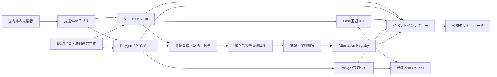
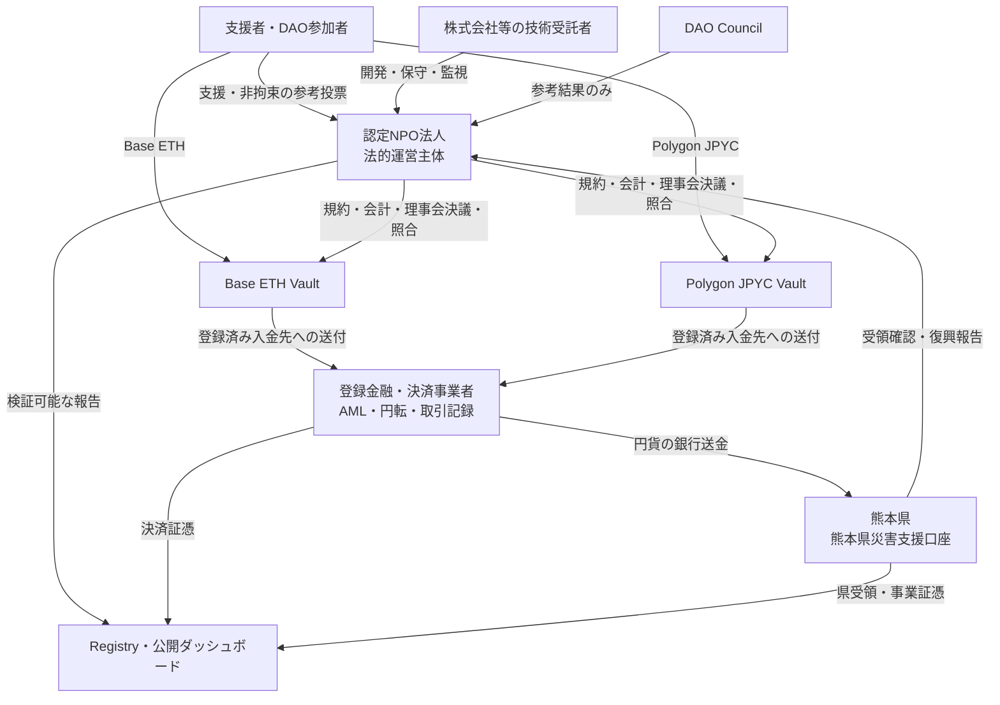
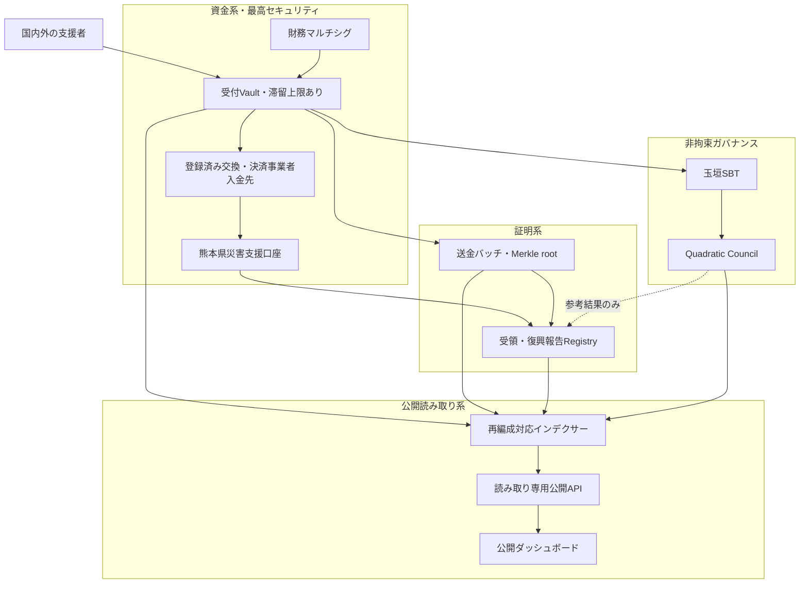
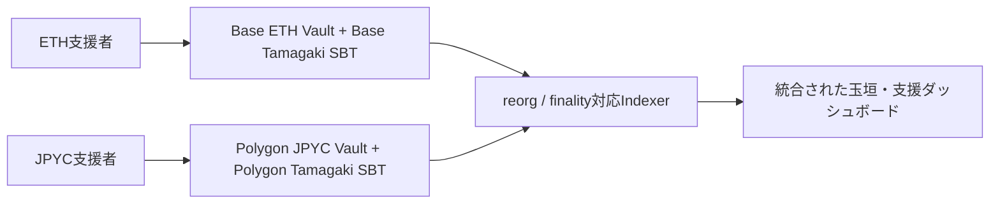
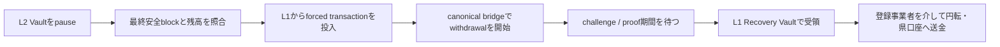

# 2. システム構造

## 全体構成

## 認定NPOを中心とする共同運営

本番候補では、災害救援・復興支援を定款に持ち、情報公開と監査体制を備えた**既存の認定NPO法人**を法的運営主体とします。認定NPOがすべての機能を自ら行うのではなく、規制金融機能、技術運用、行政判断、支援者参加を別主体へ分離します。この構成は提案であり、特定のNPO、熊本県、JPYCまたは金融事業者との提携・承認を示しません。

資金の法的帰属は利用規約、会計、コントラクトで一致させます。支援成立時に資産が認定NPOへ確定的に帰属し、支援者別残高、交換、振替、任意返金を提供しない「NPOへの支援」として設計します。認定NPOは登録事業者を介して自己資産を円転し、円貨を熊本県へ別個に寄附します。「支援者が熊本県へ直接JPYCを送る」とは表示しません。県が将来公式な収納スキームを採用した場合は、登録事業者から県への直接収納モデルへADRを更新します。

| 主体 | 法的・運用上の責務 | 持たせない権限 |
|---|---|---|
| 認定NPO法人 | 規約、寄附成立、会計、理事会決議、契約、照合、問い合わせ、公開報告 | 利用者向け交換業、単独鍵による送金、県予算の決定 |
| 登録金融・決済事業者 | 必要な登録範囲でのJPYC管理・円転、AML/CFT、制裁対応、銀行送金、取引証憑 | 復興目的、DAO投票、NPOの事業判断 |
| 株式会社等の技術受託者 | コントラクト、インデクサー、UI、監視の開発・保守 | 支援金の所有、Vaultの単独管理、任意の手数料控除 |
| 熊本県 | 円貨の受納、受領確認、復興事業と支出結果の報告 | NPOまたはDAOの未承認操作、Councilによる行政判断の拘束 |
| DAO Council | 非拘束の参考投票、改善提案、公開検証 | 資金移動、円転、法人・行政の法定意思決定 |

認定NPOであることだけで資金決済法上の登録が不要になるわけではありません。他人のための電子決済手段の管理・媒介に該当しないかを専門家と当局へ事前確認し、該当する金融機能は登録事業者へ委ねます。詳細は[ADR-0008](./adr/0008-certified-npo-joint-operation)を参照してください。

## オンチェーン構成

| コントラクト | 責務 | 資金移動権限 |
|---|---|---|
| Base `RecoverySupportVault` | chain ID `8453`、`NativeOnly`でETH受付・集約送金 | 登録済み交換・決済事業者入金先へのみ |
| Polygon `RecoverySupportVault` | chain ID `137`、`ERC20Only`で公式JPYC受付・集約送金 | 登録済み交換・決済事業者入金先へのみ |
| chain別`TamagakiSBT` | ERC-721 + ERC-5192型の譲渡不能証明 | なし |
| `RecoveryAttestationRegistry` | 県受領証跡と復興報告ハッシュ | なし |
| `RecoverySupportCouncil` | SBT保有者の非拘束投票 | なし |

## オフチェーン構成

- チェーンイベントを再編成に耐えて同期するインデクサー
- 国別・時間別・資産別の公開集計API
- 任意公開名、国、メッセージを管理する撤回可能なデータストア
- 銀行証憑・県受領確認書・復興報告書を保管する文書基盤
- 熊本県または委任先が復興報告を入力する管理インターフェース

これは本番系の原則です。画像付きSBTのSepoliaデモでは、明示的同意を得た任意表示名とメッセージをSBTのオンチェーンSVGへ直接格納する経路も検証します。この経路のデータは撤回できないため、本番採用は別途判断します。

## 権限モデル

本番では単独ウォレットを管理者にしません。管理、送金、報告を分離し、マルチシグ、タイムロック、緊急停止を組み合わせます。Vaultの送金先は、熊本県災害支援口座への円貨送金契約と結び付いた登録済み事業者入金先に限定し、DAO投票から変更できない構造とします。

## セキュリティ境界と重大な改善

本番系では、募金受付、資金保管、県への送金、受領・復興報告、公開表示、参考投票を一つの信頼境界に置きません。侵害された構成要素から被害が連鎖しないよう、資金系、証明系、公開読み取り系、参考ガバナンス系を分離します。

### 1. 資金滞留の最小化

受付Vaultを長期保管庫にしません。残高または経過時間の閾値に基づいて登録済み金融・決済事業者入金先へ集約送金し、円転後にNPOから熊本県災害支援口座への別個の円貨寄附として銀行送金します。これによりVault内の最大損失額を限定します。運営費は別会計・別口座とし、支援金から任意に控除できない構造にします。

### 2. 権限と鍵の分離

設定管理、財務送金、緊急停止、停止解除、県受領確認、復興報告を別ロールと別鍵へ分離します。受領先変更、許可資産追加、ロール変更にはマルチシグとタイムロックを要求します。緊急停止は即時実行可能としますが、解除には複数主体の承認を要求します。

### 3. 検証可能な送金バッチ

各送金バッチには、対象`supportId`一覧のMerkle root、件数、資産別数量、円転確定額、手数料、県送金額、前バッチハッシュ、証憑ハッシュを関連付けます。支援者は自身の`supportId`とMerkle proofから、どの送金バッチへ含まれたかを検証できます。インデクサーは同一支援IDの複数バッチへの重複包含を拒否します。

### 4. 読み取り基盤の分離

公開サイトからRPCの全履歴を直接集計する方式はデモに限定します。本番では複数RPC、再編成対応インデクサー、検証可能な集計DB、読み取り専用APIを介し、確認中と確定済みを分離します。最終同期ブロック、最終同期時刻、障害状態を公開します。

### 5. DAOの隔離

`RecoverySupportCouncil`をVaultの管理者、送金者、アップグレード主体にしません。投票結果は自動執行せず、熊本県の予算、調達、工事優先順位を拘束しません。投票資格は提案開始時点でスナップショットし、提案公開後の少額支援と多数ウォレットによる投票資格取得を抑制します。

## チェーン選択

本番候補では資産ごとに受付チェーンを分離します。**ETHはBase Mainnet、JPYCはPolygon PoS**を第一候補とし、それぞれ別のVaultと玉垣SBTをデプロイします。JPYCはJPYC株式会社がPolygonで公式発行する資金移動業型JPYCだけを許可し、chain ID `137`と[公式コントラクトアドレス](https://corporate.jpyc.co.jp/news/posts/Notice)をallowlistへ固定します。非公式bridge・wrapped JPYC・同名tokenは受け付けません。この選択はJPYC、登録金融・決済事業者、認定NPO、監査者との合意前の提案であり、正式対応と償還経路を確認して確定します。

玉垣SBTは単一の共通chainへcross-chain mintせず、支援を受けたchain上で原子的に発行します。したがってBase ETH支援にはBase版、Polygon JPYC支援にはPolygon版のSBTが存在します。`supportId`はchain ID、Vaultアドレス、nonce、資産、支援者、金額を含み、Webサイトはchain IDとSBTコントラクトを組にしたglobal IDで統合表示します。これによりoracleやbridgeを介した二重発行を避けます。

BaseとPolygonは異なるfinality・障害回復モデルを持ちます。Base ETHには以下のL2エスケープハッチを適用します。Polygon JPYCには[Polygonのdeterministic finalityとcheckpoint](https://docs.polygon.technology/pos/concepts/finality/finality)、公式PoS BridgeまたはJPYC EXへの直接償還を前提とする別の停止・回収手順を設け、Baseのforced transactionを流用しません。

### L2を利用する利点

- L1より低い手数料により、少額支援、玉垣SBT発行、受領・使途アテステーションを継続しやすい。
- 短いブロック間隔により、ウォレット送金から玉垣表示までの待ち時間を短縮できる。
- EVM互換L2を選べば、Solidity、Hardhat 3、ウォレット、監査ツールを共通化できる。
- L1へデータまたは状態根を確定するロールアップでは、独立したL1の安全性を最終決済の基礎として利用できる。

一方、L2上の「受付済み」はL1で確定した「最終確定」と同義ではありません。公開画面は`処理中`、`L2確認済み`、`L1確定済み`を区別し、集計・送金バッチには採用L2のfinality条件を適用します。

### L2固有リスクとエスケープハッチ

sequencer停止・検閲、Data Availability障害、L1へのbatch投稿遅延、canonical bridge障害、Fault ProofまたはValidity Proofの不具合、アップグレード管理鍵の侵害により、通常のL2操作や出金が止まる可能性があります。そのため、単なる「代替RPC」ではなく、sequencerや通常UIを信頼せずにL1から資金回収を開始できる**チェーンネイティブなエスケープハッチ**を本番要件とします。

採用するL2は、(1) transaction dataをL1で取得できること、(2) L1から強制transactionを投入できること、(3) canonical bridgeによる資産退出が可能なこと、(4) proof、challenge期間、upgrade権限が公開されていることを必須評価項目とします。BaseのようなOP Stack系L2を採用する場合は、L1のportalからのforced transaction、canonical withdrawal、Fault Proof、概ね7日間のchallenge期間を前提に手順と流動性を設計します。

プロジェクト側には、L1緊急マルチシグ、L2 Escape Controller、Ethereum L1上の固定Recovery Vault、二重送金防止台帳、L1 gas用ETHを用意します。OP Stackのaddress aliasingとcross-domain認証を考慮し、L1からの呼出しがL2 Safeと同じ送信者になるとは仮定しません。独自のzk-STARKをアプリへ追加するだけではsequencer停止時の資産退出にならないため、ロールアップ本体のproof・Data Availability・bridgeを利用します。

現行プロトタイプにはこの回収経路が未実装です。Base Sepoliaを含む公開テストネットでforced transactionからL1受領、残高照合、通常経路との二重送金防止まで訓練し、外部監査を完了するまでBaseで実資金を受け付けません。詳細は[ADR-0009](./adr/0009-l2-selection-and-escape-hatch)を参照してください。
