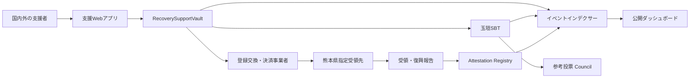
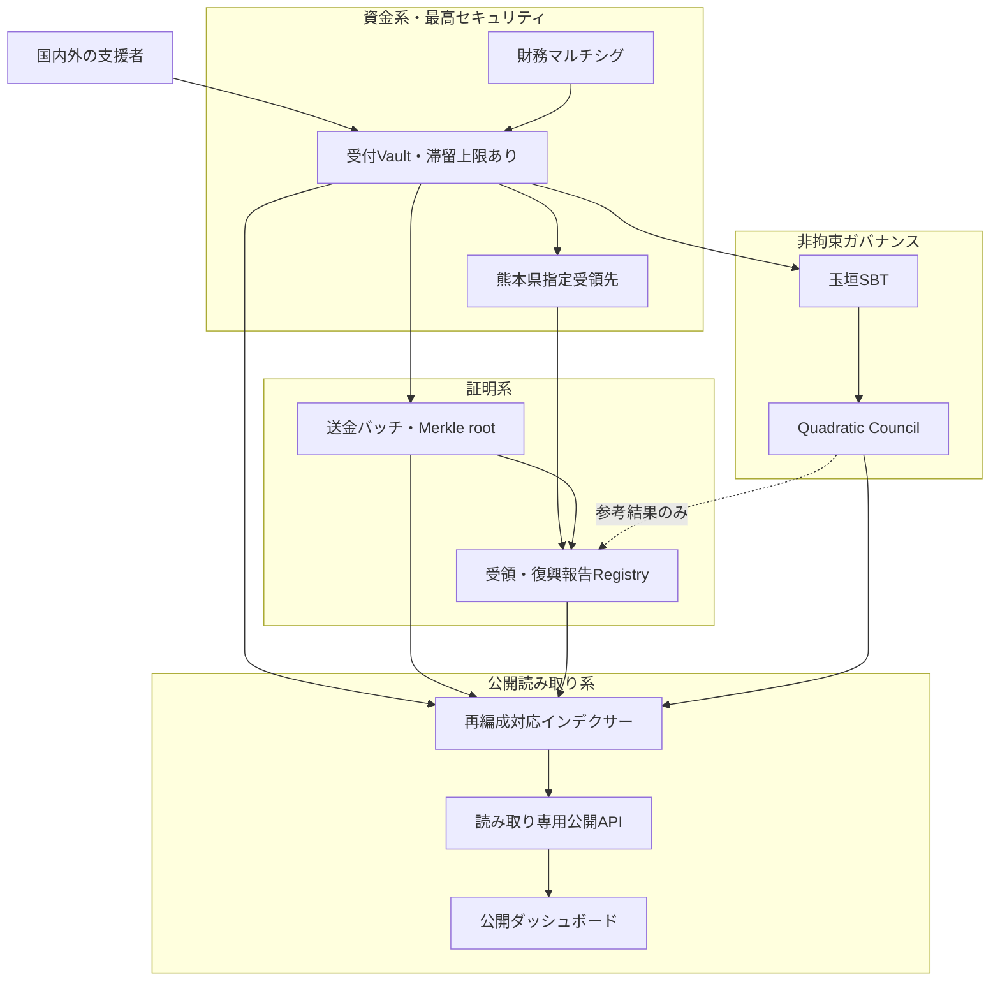

# 2. システム構造

## 全体構成

## オンチェーン構成

| コントラクト | 責務 | 資金移動権限 |
|---|---|---|
| `RecoverySupportVault` | ETH・許可済みERC-20受付、集約送金 | 熊本県指定先へのみ |
| `TamagakiSBT` | ERC-721 + ERC-5192型の譲渡不能証明 | なし |
| `RecoveryAttestationRegistry` | 県受領証跡と復興報告ハッシュ | なし |
| `RecoverySupportCouncil` | SBT保有者の非拘束投票 | なし |

## オフチェーン構成

- チェーンイベントを再編成に耐えて同期するインデクサー
- 国別・時間別・資産別の公開集計API
- 任意公開名、国、メッセージを管理する撤回可能なデータストア
- 銀行証憑・県受領確認書・復興報告書を保管する文書基盤
- 熊本県または委任先が復興報告を入力する管理インターフェース

これは本番系の原則です。画像付きSBTのSepoliaデモでは、明示的同意を得た任意表示名とメッセージをSBTのオンチェーンSVGへ直接格納する経路も検証します。この経路のデータは撤回できないため、本番採用は別途判断します。

## 権限モデル

本番では単独ウォレットを管理者にしません。管理、送金、報告を分離し、マルチシグ、タイムロック、緊急停止を組み合わせます。送金先はコントラクト上で熊本県指定先に固定し、DAO投票から変更できない構造とします。

## セキュリティ境界と重大な改善

本番系では、募金受付、資金保管、県への送金、受領・復興報告、公開表示、参考投票を一つの信頼境界に置きません。侵害された構成要素から被害が連鎖しないよう、資金系、証明系、公開読み取り系、参考ガバナンス系を分離します。

### 1. 資金滞留の最小化

受付Vaultを長期保管庫にしません。残高または経過時間の閾値に基づいて熊本県指定先へ集約送金し、Vault内の最大損失額を限定します。運営費は別会計・別口座とし、支援金から任意に控除できない構造にします。

### 2. 権限と鍵の分離

設定管理、財務送金、緊急停止、停止解除、県受領確認、復興報告を別ロールと別鍵へ分離します。受領先変更、許可資産追加、ロール変更にはマルチシグとタイムロックを要求します。緊急停止は即時実行可能としますが、解除には複数主体の承認を要求します。

### 3. 検証可能な送金バッチ

各送金バッチには、対象`supportId`一覧のMerkle root、件数、資産別数量、円転確定額、手数料、県送金額、前バッチハッシュ、証憑ハッシュを関連付けます。支援者は自身の`supportId`とMerkle proofから、どの送金バッチへ含まれたかを検証できます。インデクサーは同一支援IDの複数バッチへの重複包含を拒否します。

### 4. 読み取り基盤の分離

公開サイトからRPCの全履歴を直接集計する方式はデモに限定します。本番では複数RPC、再編成対応インデクサー、検証可能な集計DB、読み取り専用APIを介し、確認中と確定済みを分離します。最終同期ブロック、最終同期時刻、障害状態を公開します。

### 5. DAOの隔離

`RecoverySupportCouncil`をVaultの管理者、送金者、アップグレード主体にしません。投票結果は自動執行せず、熊本県の予算、調達、工事優先順位を拘束しません。投票資格は提案開始時点でスナップショットし、提案公開後の少額支援と多数ウォレットによる投票資格取得を抑制します。

## チェーン選択

低コストなEVM L2を基本候補とし、公式JPYCが利用できるネットワークと、運用事業者が正式対応するチェーンを採用します。非公式ブリッジ資産は許可しません。最終的なネットワークはJPYC、交換・決済事業者、監査者との協議後に確定します。
