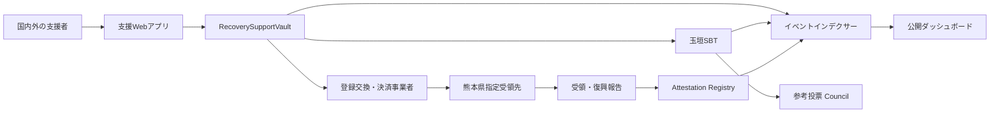

# 2. システム構造

## 全体構成

## オンチェーン構成

| コントラクト | 責務 | 資金移動権限 |
|---|---|---|
| `RecoverySupportVault` | ETH・許可済みERC-20受付、集約送金 | 熊本県指定先へのみ |
| `TamagakiSBT` | ERC-721 + ERC-5192型の譲渡不能証明 | なし |
| `RecoveryAttestationRegistry` | 県受領証跡と復興報告ハッシュ | なし |
| `RecoverySupportCouncil` | SBT保有者の非拘束投票 | なし |

## オフチェーン構成

- チェーンイベントを再編成に耐えて同期するインデクサー
- 国別・時間別・資産別の公開集計API
- 任意公開名、国、メッセージを管理する撤回可能なデータストア
- 銀行証憑・県受領確認書・復興報告書を保管する文書基盤
- 熊本県または委任先が復興報告を入力する管理インターフェース

## 権限モデル

本番では単独ウォレットを管理者にしません。管理、送金、報告を分離し、マルチシグ、タイムロック、緊急停止を組み合わせます。送金先はコントラクト上で熊本県指定先に固定し、DAO投票から変更できない構造とします。

## チェーン選択

低コストなEVM L2を基本候補とし、公式JPYCが利用できるネットワークと、運用事業者が正式対応するチェーンを採用します。非公式ブリッジ資産は許可しません。最終的なネットワークはJPYC、交換・決済事業者、監査者との協議後に確定します。
