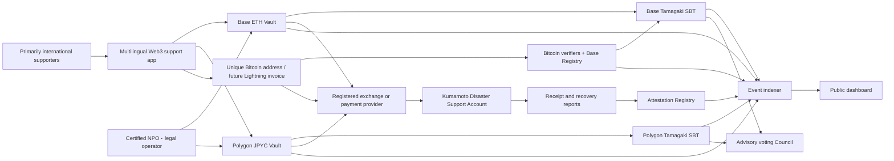
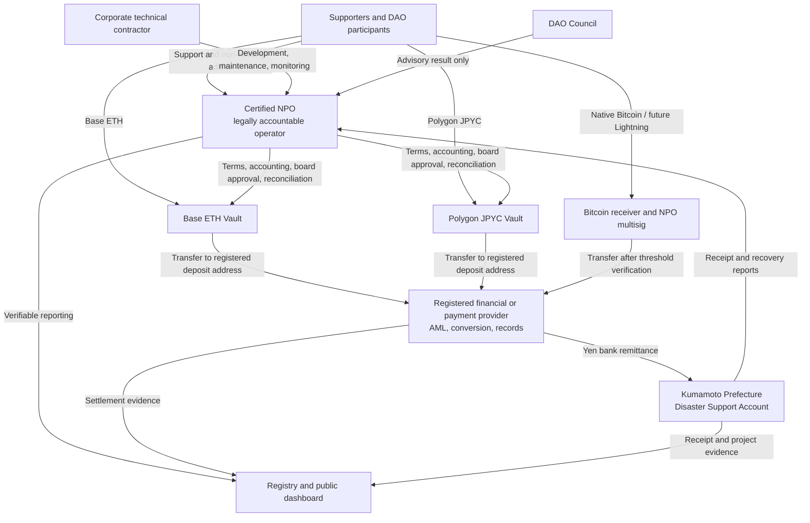
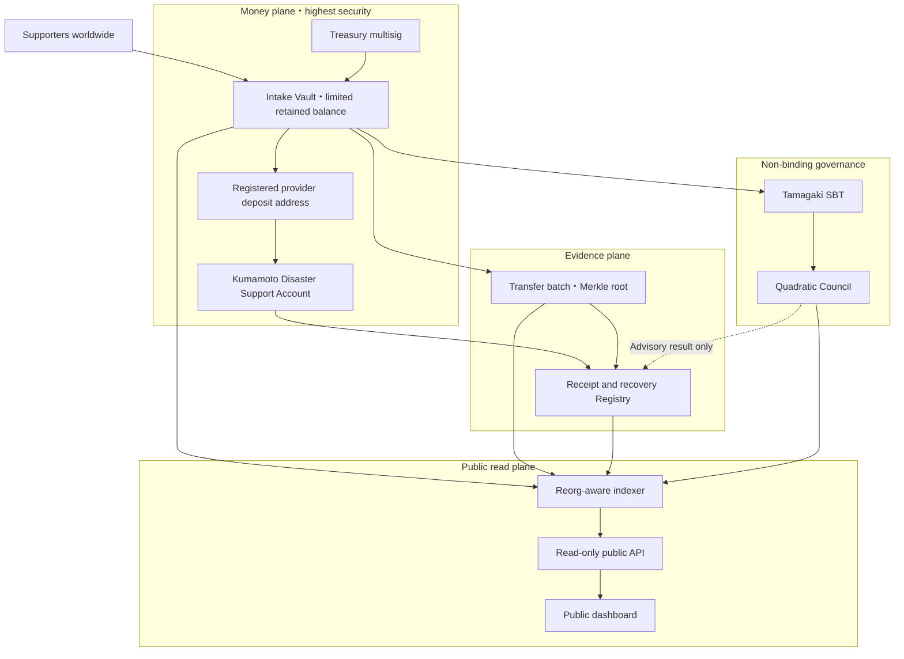
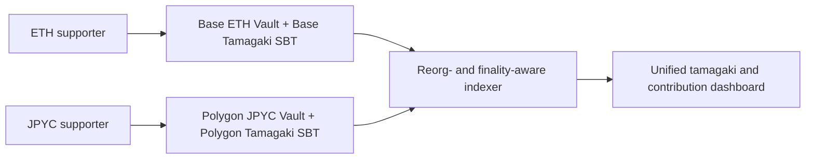
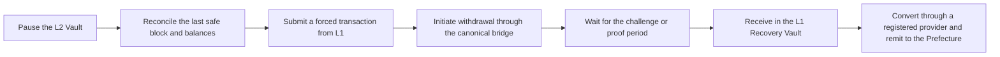

# 2. System Architecture

## Overview

## Joint operation led by a certified NPO

The production candidate appoints an **existing certified NPO** whose charter covers disaster relief and recovery, and which has suitable disclosure and audit controls, as the legally accountable operator. The NPO does not perform every function itself: regulated financial services, technical operations, public administration, and supporter participation remain with separate actors. This is a proposal and does not imply endorsement or partnership by any NPO, Kumamoto Prefecture, JPYC, or financial provider.

Terms, accounting, and contract behavior must agree on legal ownership. At completion of support, the asset becomes the NPO's property without creating supporter balances or services for exchange, onward transfer, or discretionary refunds. The NPO converts its own asset through a registered provider and makes a separate yen donation to Kumamoto Prefecture. The service must not claim that a supporter sends JPYC directly to the Prefecture. If the Prefecture later adopts an official collection arrangement, the ADR must be revised for direct collection through the registered provider.

| Actor | Legal and operational responsibility | Authority it must not receive |
|---|---|---|
| Certified NPO | Terms, completion of donation, accounting, board decisions, contracts, reconciliation, support, disclosure | Customer exchange services, unilateral treasury control, prefectural budget decisions |
| Registered financial or payment provider | ETH, JPYC, and BTC conversion within its registrations, AML/CFT, sanctions controls, bank remittance, transaction evidence | Recovery priorities, DAO voting, NPO programme decisions |
| Corporate technical contractor | Development and maintenance of contracts, indexer, UI, and monitoring | Ownership of support funds, unilateral Vault control, arbitrary fee deductions |
| Kumamoto Prefecture | Acceptance of yen, receipt confirmation, recovery work and expenditure reporting | Unapproved NPO/DAO operations or Council control of administrative decisions |
| DAO Council | Non-binding voting, improvement proposals, public verification | Transfers, conversion, or statutory corporate and administrative decisions |

Certified-NPO status alone does not remove Payment Services Act requirements. The parties must obtain legal and regulatory confirmation that the model is not managing or intermediating electronic payment instruments for others, and assign any regulated function to an appropriately registered provider.

## On-chain components

| Contract | Responsibility | Authority to move funds |
|---|---|---|
| Base `RecoverySupportVault` | Chain ID `8453`, `NativeOnly` ETH intake and consolidation | Only to a registered exchange or payment-provider deposit address |
| Polygon `RecoverySupportVault` | Chain ID `137`, `ERC20Only` official-JPYC intake and consolidation | Only to a registered exchange or payment-provider deposit address |
| Base `BitcoinSupportRegistry` | Threshold attestations for Bitcoin outpoints or Lightning payment commitments and duplicate prevention | None |
| Per-chain `TamagakiSBT` | Non-transferable ERC-721 and ERC-5192 participation proof | None |
| `RecoveryAttestationRegistry` | Records hashes of prefectural receipt evidence and recovery reports | None |
| `RecoverySupportCouncil` | Non-binding voting by SBT holders | None |

## Off-chain components

- An indexer that synchronizes chain events safely across reorganizations
- An isolated wallet service that derives donation-specific Bitcoin addresses, independent Bitcoin nodes, and a threshold-attestation service; the Lightning node is added only after exception approval
- Public aggregation APIs by country, time, and asset
- A revocable data store for optional public names, countries, and messages
- A document platform for bank evidence, prefectural acknowledgements, and recovery reports
- An administrative interface for Kumamoto Prefecture or an authorized reporting party

This is the production principle. The image-enabled Sepolia demo also evaluates a path that embeds an optional display name and message directly in the SBT's on-chain SVG after explicit consent. That data cannot be withdrawn, so production adoption requires a separate decision.

### Bitcoin-to-Base boundary

Native BTC is not bridged into an EVM Vault. A unique Bitcoin address or one-time Lightning invoice maps to a signed donation intent. Independent verifiers confirm the required confirmations or settlement and submit a threshold attestation to a Base Registry. The ERC-721 and ERC-5192 Tamagaki SBT is then minted to the Base address selected before payment. For Lightning, the Registry receives a domain-separated commitment rather than the underlying payment hash. Bitcoin private keys, xprvs, Lightning macaroons, payment hashes, and preimages never enter Base or the public indexer. See [ADR-0011](../adr/0011-bitcoin-lightning-and-base-sbt).

## Permission model

Production administration will not rely on a single wallet. As a stronger rule, **application servers, databases, indexers, public Web servers, and Bitcoin Core never store a private key capable of moving funds**. Administration, treasury transfers, and reporting are separated across hardware wallets, multisignature approval, timelocks, HSM/KMS signing, and emergency pausing. The destination is restricted to the registered provider address contractually linked to a yen donation into the Kumamoto Disaster Support Account and cannot be changed by DAO voting.

| Key or credential | Location | Policy |
|---|---|---|
| Supporter key | The supporter's own wallet | The site never requests a seed or private key |
| EVM treasury and administration keys | Hardware wallets held by separate organizations | Safe-style multisig and timelock; no server-side signing |
| Bitcoin custody keys | Hardware wallets held by separate organizations | Watch-only descriptor and PSBT; no seed in Bitcoin Core |
| Attestation and Paymaster keys | HSM/KMS under independent operators | Non-exportable, least privilege, threshold approval, no treasury authority |
| LND macaroon | Restricted invoice service | Invoice RPCs only; never distribute administrator authority |
| Lightning channel key | Remote signer or dedicated isolated environment | A narrowly approved online-key exception; Lightning is disabled at initial production launch |

For a Bitcoin withdrawal, a server prepares an unsigned PSBT. Hardware-wallet holders representing multiple certified-NPO staff, a joint operator, and independent audit or partner organizations verify the destination, amount, and fee and provide the required signatures. In the initial candidate, prefectural staff hold neither Bitcoin custody keys nor Vault transfer keys. Bitcoin Core broadcasts only the completed PSBT. Because a server compromise can still falsify a screen or interrupt service, signers compare the hardware-wallet display with transfer instructions delivered over a separate channel.

A Lightning node must sign channel state while online, so it cannot fully satisfy the offline-key rule. Initial production therefore enables Native Bitcoin only. Lightning requires a separate exception review covering a remote signer or external provider, hot-balance limits, recovery drills, and restricted macaroons. See [ADR-0011](../adr/0011-bitcoin-lightning-and-base-sbt).

## Security boundaries and critical improvements

Production does not place support intake, custody, prefectural transfer, attestations, public presentation, and advisory voting inside one trust boundary. The money, evidence, public-read, and advisory-governance planes are isolated so that compromise of one component does not automatically propagate to the others.

### 1. Minimize retained funds

The intake Vault is not a long-term store of value. Consolidated transfers are triggered by balance or elapsed-time thresholds; after registered conversion, the remittance is treated as the NPO's separate yen donation to Kumamoto Prefecture. Operating expenses use separate accounts and accounting and cannot be deducted arbitrarily from recovery support.

### 2. Separate authority and keys

Configuration, treasury transfer, emergency pause, unpause, prefectural receipt confirmation, and recovery reporting use distinct roles and keys. Recipient changes, asset allowlisting, and role changes require a multisig and timelock. Emergency pausing may be immediate, while unpausing requires approval by multiple parties.

### 3. Verifiable transfer batches

Each batch binds a Merkle root of included `supportId` values, item count, quantities by asset, confirmed yen conversion, fees, prefectural transfer amount, previous-batch hash, and evidence hash. A supporter can verify inclusion using their `supportId` and a Merkle proof. The indexer rejects inclusion of the same support ID in multiple batches.

### 4. Isolate the read infrastructure

Directly scanning all RPC history from the public site is limited to the demo. Production uses multiple RPC providers, a reorg-aware indexer, a verifiable aggregation database, and a read-only API. Pending and finalized values are separated, and the last synchronized block, synchronization time, and outage state are public.

### 5. Isolate the DAO

`RecoverySupportCouncil` is never a Vault administrator, treasurer, or upgrade authority. Results are not executed automatically and do not bind Kumamoto Prefecture's budget, procurement, or construction priorities. Voting eligibility is snapshotted when a proposal begins to reduce qualification through post-publication micro-contributions and many newly created wallets.

## Chain selection

The production candidate routes each asset to a different network: **ETH on Base Mainnet and JPYC on Polygon PoS**. Each network has its own Vault and Tamagaki SBT contract. The Polygon Vault accepts only the funds-transfer-service JPYC officially issued by JPYC Inc.; chain ID `137` and the [official contract address](https://corporate.jpyc.co.jp/news/posts/Notice) are pinned in the allowlist. Unofficial bridges, wrapped JPYC, and look-alike tokens are rejected. This remains a proposal until JPYC Inc., the registered provider, the certified NPO, and auditors confirm formal support and redemption operations.

The SBT is minted atomically on the network that receives the contribution, rather than cross-chain minting onto one common network. A Base ETH contribution therefore receives a Base SBT, while a Polygon JPYC contribution receives a Polygon SBT. The `supportId` includes chain ID, Vault, nonce, asset, supporter, and amount; the site combines chain ID and SBT contract into a global identifier. This avoids oracle- or bridge-mediated duplicate minting.

Base and Polygon have different finality and recovery models. The L2 escape hatch below applies to Base ETH. Polygon JPYC receives a separate halt and recovery procedure based on [Polygon deterministic finality and checkpoints](https://docs.polygon.technology/pos/concepts/finality/finality), the official PoS Bridge or direct JPYC EX redemption; Base forced transactions are not reused for Polygon.

### Benefits of using an L2

- Lower fees make small contributions, Tamagaki SBT issuance, and receipt or use-of-funds attestations sustainable.
- Short block times reduce the delay between wallet payment and public Tamagaki display.
- An EVM-compatible L2 preserves the Solidity, Hardhat 3, wallet, and audit toolchain.
- A rollup that commits data or state roots to L1 can use Ethereum as its final-settlement foundation.

“Accepted on L2” is not the same as “finalized on L1.” The public interface therefore distinguishes `pending`, `confirmed on L2`, and `finalized on L1`, and settlement batches apply the selected L2's finality rule.

### L2-specific risk and escape hatch

Sequencer outage or censorship, data-availability failure, delayed batch submission, canonical-bridge failure, proof-system defects, or compromised upgrade authority can stop ordinary L2 operations and withdrawals. Production therefore requires a **chain-native escape hatch** that can begin recovery from L1 without trusting the sequencer, ordinary RPC, or project UI.

Candidate L2s must provide L1-available transaction data, L1 forced transactions, canonical asset withdrawal, and transparent proof, challenge-period, and upgrade-authority rules. For an OP Stack L2 such as Base, the design assumes portal-based forced transactions, canonical withdrawals, fault proofs, and an approximately seven-day challenge period.

Project controls include an L1 emergency multisig, an L2 Escape Controller, a fixed Ethereum L1 Recovery Vault, a double-payment prevention ledger, and an ETH reserve for L1 gas. OP Stack address aliasing and cross-domain authentication must be handled explicitly; an L1 call is not assumed to have the same sender as an L2 Safe. Adding an application-specific zk-STARK alone does not create an asset exit during sequencer failure, so the design uses the rollup's native proof, data-availability, and bridge mechanisms.

The current prototype does not implement this recovery path. No real funds will be accepted on Base until forced transaction, L1 receipt, reconciliation, and double-payment prevention have been exercised on a public testnet including Base Sepolia and independently audited. See [ADR-0009](../adr/0009-l2-selection-and-escape-hatch).
