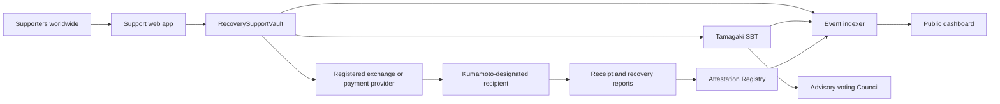
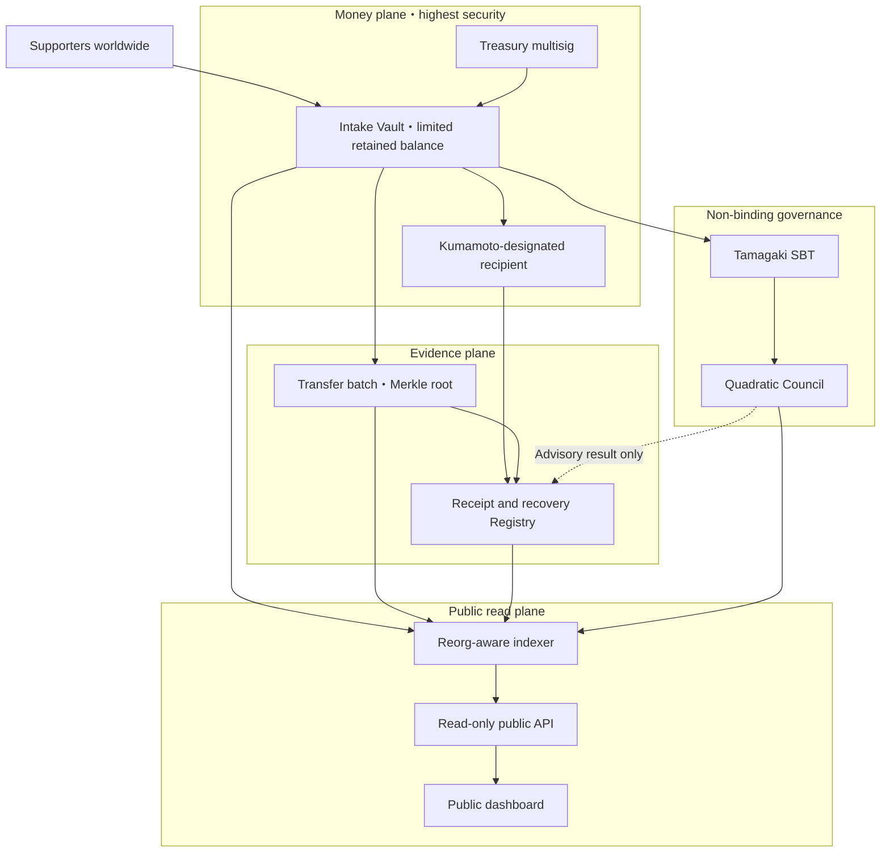

# 2. System Architecture

## Overview

## On-chain components

| Contract | Responsibility | Authority to move funds |
|---|---|---|
| `RecoverySupportVault` | Receives ETH and approved ERC-20 assets and consolidates transfers | Only to a Kumamoto-designated destination |
| `TamagakiSBT` | Non-transferable ERC-721 and ERC-5192 participation proof | None |
| `RecoveryAttestationRegistry` | Records hashes of prefectural receipt evidence and recovery reports | None |
| `RecoverySupportCouncil` | Non-binding voting by SBT holders | None |

## Off-chain components

- An indexer that synchronizes chain events safely across reorganizations
- Public aggregation APIs by country, time, and asset
- A revocable data store for optional public names, countries, and messages
- A document platform for bank evidence, prefectural acknowledgements, and recovery reports
- An administrative interface for Kumamoto Prefecture or an authorized reporting party

This is the production principle. The image-enabled Sepolia demo also evaluates a path that embeds an optional display name and message directly in the SBT's on-chain SVG after explicit consent. That data cannot be withdrawn, so production adoption requires a separate decision.

## Permission model

Production administration will not rely on a single wallet. Administration, treasury transfers, and reporting are separated and protected through multisignature approval, timelocks, and emergency pausing. The destination is restricted in the contract to an address designated by Kumamoto Prefecture and cannot be changed by DAO voting.

## Security boundaries and critical improvements

Production does not place support intake, custody, prefectural transfer, attestations, public presentation, and advisory voting inside one trust boundary. The money, evidence, public-read, and advisory-governance planes are isolated so that compromise of one component does not automatically propagate to the others.

### 1. Minimize retained funds

The intake Vault is not a long-term store of value. Consolidated transfers are triggered by balance or elapsed-time thresholds, limiting the maximum value exposed in the Vault. Operating expenses use separate accounts and accounting and cannot be deducted arbitrarily from recovery support.

### 2. Separate authority and keys

Configuration, treasury transfer, emergency pause, unpause, prefectural receipt confirmation, and recovery reporting use distinct roles and keys. Recipient changes, asset allowlisting, and role changes require a multisig and timelock. Emergency pausing may be immediate, while unpausing requires approval by multiple parties.

### 3. Verifiable transfer batches

Each batch binds a Merkle root of included `supportId` values, item count, quantities by asset, confirmed yen conversion, fees, prefectural transfer amount, previous-batch hash, and evidence hash. A supporter can verify inclusion using their `supportId` and a Merkle proof. The indexer rejects inclusion of the same support ID in multiple batches.

### 4. Isolate the read infrastructure

Directly scanning all RPC history from the public site is limited to the demo. Production uses multiple RPC providers, a reorg-aware indexer, a verifiable aggregation database, and a read-only API. Pending and finalized values are separated, and the last synchronized block, synchronization time, and outage state are public.

### 5. Isolate the DAO

`RecoverySupportCouncil` is never a Vault administrator, treasurer, or upgrade authority. Results are not executed automatically and do not bind Kumamoto Prefecture's budget, procurement, or construction priorities. Voting eligibility is snapshotted when a proposal begins to reduce qualification through post-publication micro-contributions and many newly created wallets.

## Chain selection

A low-cost EVM L2 is the primary candidate. The selected network must support official JPYC and be formally supported by the operating service providers. Unofficial bridged assets will not be accepted. The final network will be determined after consultation with JPYC, exchange or payment providers, and auditors.
