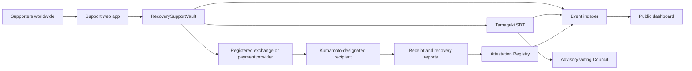

# 2. System Architecture

## Overview

## On-chain components

| Contract | Responsibility | Authority to move funds |
|---|---|---|
| `RecoverySupportVault` | Receives ETH and approved ERC-20 assets and consolidates transfers | Only to a Kumamoto-designated destination |
| `TamagakiSBT` | Non-transferable ERC-721 and ERC-5192 participation proof | None |
| `RecoveryAttestationRegistry` | Records hashes of prefectural receipt evidence and recovery reports | None |
| `RecoverySupportCouncil` | Non-binding voting by SBT holders | None |

## Off-chain components

- An indexer that synchronizes chain events safely across reorganizations
- Public aggregation APIs by country, time, and asset
- A revocable data store for optional public names, countries, and messages
- A document platform for bank evidence, prefectural acknowledgements, and recovery reports
- An administrative interface for Kumamoto Prefecture or an authorized reporting party

## Permission model

Production administration will not rely on a single wallet. Administration, treasury transfers, and reporting are separated and protected through multisignature approval, timelocks, and emergency pausing. The destination is restricted in the contract to an address designated by Kumamoto Prefecture and cannot be changed by DAO voting.

## Chain selection

A low-cost EVM L2 is the primary candidate. The selected network must support official JPYC and be formally supported by the operating service providers. Unofficial bridged assets will not be accepted. The final network will be determined after consultation with JPYC, exchange or payment providers, and auditors.
