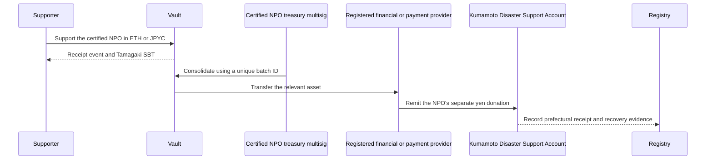

# 3. Support and Fund Flow

## Receiving support

Supporters send ETH or official JPYC on an approved network. The contract rejects zero-value transactions, unapproved assets, and contributions while paused, then issues a support ID and receipt event.

Country, public name, and message are optional. Country is never inferred from a wallet or IP address; only self-declared information is aggregated.

## Consolidation and transfer to Kumamoto Prefecture

The contract does not perform exchange services. The asset becomes the certified NPO's property when support completes, without supporter balances, exchange, or transfer services. A provider with the required registration and controls converts the NPO's own asset, and the NPO makes a separate yen donation to Kumamoto Prefecture. This is not presented as a direct JPYC donation to the Prefecture.

## Accounting presentation

The public interface separately shows quantities by asset, indicative ETH value, confirmed yen value at conversion, amount remitted to Kumamoto Prefecture, amount pending, balance, and fees.

The core reconciliation is:

$$
R = K + P + B + F
$$

Here, $R$ is the amount received, $K$ is the amount remitted to Kumamoto Prefecture, $P$ is the amount pending, $B$ is the balance, and $F$ is disclosed fees. Indicative valuations are never presented as confirmed receipts.

## Proof of receipt

Bank evidence and administrative documents are not placed directly on a public chain. The system records document hashes, batch IDs, confirmed yen amounts, and confirmation timestamps. Anyone can hash a published document and compare it with the on-chain record.
