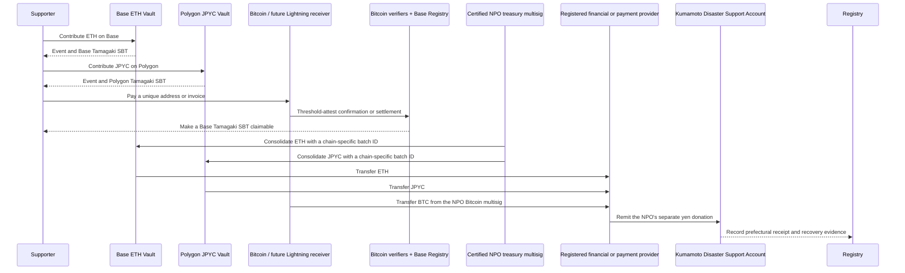

# 3. Support and Fund Flow

## Receiving support

International supporters may send ETH to the Base Mainnet Vault, official JPYC to the Polygon PoS Vault, or Native BTC to a donation-specific Bitcoin address. EVM Vaults atomically mint a Tamagaki SBT on the same chain. Native Bitcoin mints a Base SBT only after confirmation and threshold attestation. A Lightning invoice follows the same non-atomic model but is disabled at initial production launch and added only after the ADR-0011 exception conditions are met.

Country, public name, and message are optional. Country is never inferred from a wallet or IP address; only self-declared information is aggregated.

## Consolidation and transfer to Kumamoto Prefecture

The contracts, Bitcoin receiver, and DAO do not perform exchange services. The asset becomes the certified NPO's property when support completes, without supporter balances, exchange, or transfer services. A provider with the required registration and controls converts the NPO's ETH, JPYC, or BTC, and the NPO makes a separate yen donation to Kumamoto Prefecture. This is not presented as a direct cryptoasset donation to the Prefecture.

## Bitcoin confirmation model

Native Bitcoin separates `Detected → Confirmed → Accepted → SBTIssued`; zero-confirmation payments are excluded from confirmed totals. Lightning uses a one-time invoice and verifies settlement against the payment hash in a restricted audit domain. The public Registry receives a domain-separated commitment, and one `txid:vout` or payment commitment can produce at most one SBT. See [ADR-0011](../adr/0011-bitcoin-lightning-and-base-sbt).

## Accounting presentation

The public interface separately shows quantities by asset, indicative ETH value, confirmed yen value at conversion, amount remitted to Kumamoto Prefecture, amount pending, balance, and fees.

The core reconciliation is:

$$
R = K + P + B + F
$$

Here, $R$ is the amount received, $K$ is the amount remitted to Kumamoto Prefecture, $P$ is the amount pending, $B$ is the balance, and $F$ is disclosed fees. Indicative valuations are never presented as confirmed receipts.

## Proof of receipt

Bank evidence and administrative documents are not placed directly on a public chain. The system records document hashes, batch IDs, confirmed yen amounts, and confirmation timestamps. Anyone can hash a published document and compare it with the on-chain record.
