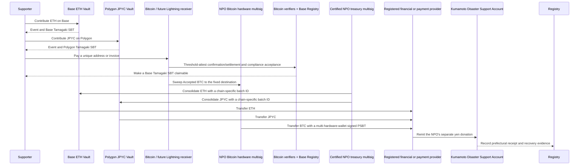

# 3. Support and Fund Flow

## Receiving support

International supporters may send ETH to the Base Mainnet Vault, official JPYC to the Polygon PoS Vault, or Native BTC to a donation-specific Bitcoin address. EVM Vaults atomically mint a Tamagaki SBT on the same chain. Native Bitcoin mints a Base SBT only after confirmation and threshold attestation. A Lightning invoice follows the same non-atomic model but is disabled at initial production launch and added only after the key, liquidity, legal, and compliance conditions in ADR-0011, ADR-0012, and ADR-0013 are met.

Country, public name, and message are optional. Country is never inferred from a wallet or IP address; only self-declared information is aggregated.

## Consolidation and transfer to Kumamoto Prefecture

The contracts, Bitcoin receiver, and DAO do not perform exchange services. EVM support is recognized on receipt; Bitcoin and Lightning support is recognized only after confirmation and compliance acceptance. No supporter balance, exchange, or transfer service is offered. Long-term custody of Accepted BTC requires the certified-NPO-controlled Bitcoin hardware multisig, while LND holds only bounded channel operating funds. A provider with the required registration and controls converts the NPO's ETH, JPYC, or BTC, and the NPO makes a separate yen donation to Kumamoto Prefecture. This is not presented as a direct cryptoasset donation to the Prefecture.

## Bitcoin confirmation model

Native Bitcoin separates `Detected → Confirmed → ComplianceReview → Accepted → SBTIssued`; zero-confirmation payments are excluded from confirmed totals. Lightning separates `Settled → ComplianceReview → Accepted / Held / Rejected`. The public Registry receives a domain-separated commitment, and one `txid:vout` or payment commitment can produce at most one SBT. See [ADR-0011](../adr/0011-bitcoin-lightning-and-base-sbt) and [ADR-0013](../adr/0013-lightning-legal-classification-and-abuse-controls).

## Accounting presentation

The public interface separately shows quantities by asset, indicative ETH value, confirmed yen value at conversion, amount remitted to Kumamoto Prefecture, amount pending, balance, and fees.

Asset quantities and post-conversion yen are never mixed in one equation. Per asset and route, reconciliation is:

$$
R_a = B_a + X_a + F_a + A_a
$$

Here, $R_a$ is the final accepted quantity of asset $a$, $B_a$ is the unconsolidated balance, $X_a$ is the amount transferred to the registered provider, $F_a$ is explicit fees denominated in that asset, and $A_a$ is the correction balance. Each conversion batch separately reconciles `gross yen proceeds = yen remitted to the Prefecture + yen pending + explicit yen-denominated fees`. Indicative valuations are never presented as confirmed receipts.

## Proof of receipt

Bank evidence and administrative documents are not placed directly on a public chain. The system records document hashes, batch IDs, confirmed yen amounts, and confirmation timestamps. Anyone can hash a published document and compare it with the on-chain record.
