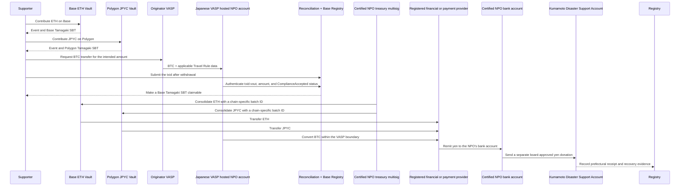

# 3. Support and Fund Flow

## Receiving support

International supporters may send ETH to the Base Mainnet Vault or official JPYC to the Polygon PoS Vault. For initial-production Bitcoin, the supporter first creates a support intent and sends Native BTC from an originator VASP to an NPO-specific account hosted by a Japanese-registered beneficiary VASP. That VASP performs Travel Rule processing, AML/CFT and sanctions review, custody, and conversion. A Base SBT is issued only after reconciliation of an `Accepted` deposit. Direct self-custody and Lightning intake remain disabled until the conditions in ADR-0011 through ADR-0014 are met.

Country, public name, and message are optional. Country is never inferred from a wallet or IP address; only self-declared information is aggregated.

## Consolidation and transfer to Kumamoto Prefecture

The contracts, DAO, and certified NPO do not perform exchange services. EVM support is recognized on receipt; initial-production Bitcoin is recognized only after the registered VASP marks it `ComplianceAccepted`. No supporter balance, exchange, or transfer service is offered. The VASP custodies and converts BTC and remits yen to the NPO's bank account. Following board approval, the NPO makes a separate yen donation to Kumamoto Prefecture. The NPO hardware multisig and LND are later-phase paths, not initial-production components.

## Bitcoin confirmation model

Initial-production Native Bitcoin separates `IntentCreated → TravelRuleAccepted / Held / Rejected → DepositDetected → Confirmed → ComplianceAccepted / Held / Rejected → SBTIssued → Converted → BankRemitted`. The pre-payment intent excludes the unknown txid. After payment, verifiers reconcile the beneficiary VASP's authenticated deposit record with the public chain and bind the `txid:vout`, actual amount, and confirmation reference in their attestation. PII and internal VASP identifiers never enter the public Registry. Lightning retains the future-state model `Settled → ComplianceReview → Accepted / Held / Rejected`.

## Accounting presentation

The public interface separately shows quantities by asset, indicative ETH value, confirmed yen value at conversion, amount remitted to Kumamoto Prefecture, amount pending, balance, and fees.

Asset quantities and post-conversion yen are never mixed in one equation. Per asset and route, reconciliation is:

$$
R_a = B_a + X_a + F_a + A_a
$$

Here, $R_a$ is the final accepted quantity of asset $a$, $B_a$ is the unconsolidated balance, $X_a$ is the amount transferred to the registered provider, $F_a$ is explicit fees denominated in that asset, and $A_a$ is the correction balance. Each conversion batch separately reconciles `gross yen proceeds = yen remitted to the Prefecture + yen pending + explicit yen-denominated fees`. Indicative valuations are never presented as confirmed receipts.

## Proof of receipt

Bank evidence and administrative documents are not placed directly on a public chain. The system records document hashes, batch IDs, confirmed yen amounts, and confirmation timestamps. Anyone can hash a published document and compare it with the on-chain record.
