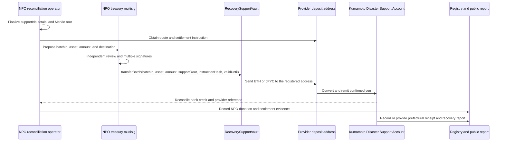

# Certified NPO and Prefectural Operations

This page is a proposed operating model for discussion with Kumamoto Prefecture, the certified NPO acting as legal operator, and the registered financial or payment provider. In the initial production candidate, the NPO controls the Vault and treasury multisig; prefectural staff normally hold no Vault transfer key and instead accept yen and provide prefectural reporting. This is not an approved procedure, account designation, or partnership with any NPO.

## End-to-end settlement

A smart contract cannot remit directly to a bank account. A contracted and registered exchange or payment provider bridges the on-chain asset and yen settlement boundary.



## 1. Separate roles

| Role | Primary operation | Authority it must not hold |
|---|---|---|
| NPO configuration administration | Assets, destinations, and roles | Routine unilateral transfer |
| NPO treasury signer | Review and sign batches approved through NPO procedures | Unilateral destination change |
| Emergency pause | Immediate `pause` | Unpause or transfer |
| Reconciliation | Totals, quote, bank credit, evidence | On-chain signing |
| NPO reporting | Reconcile provider and prefectural evidence and record attestations | Vault fund movement |
| Kumamoto Prefecture | Accept yen and provide receipt, recovery-project, and expenditure evidence | Vault administration or conversion |
| Audit | Logs, evidence, balances, invariants | Configuration or signing |

The demo may reuse one account, but production must not. No financial, administrative, pause, or reporting role is granted to the DAO advisory-voting key.

## 2. Initialize staff wallets

1. The certified NPO assigns an organization-managed signing workstation and organization-procured hardware wallet to each signer. Prefectural staff are not Vault signers unless a future official collection model is adopted.
2. Separate personal, routine, testnet, and production accounts. Never attach a personal wallet to a production signing workstation.
4. Store sealed recovery material in two physically separate controlled locations with access logs.
5. Treat MetaMask or another browser wallet only as a transaction interface. Fix the approved distribution source, extension identifier, and update procedure.
6. Register the approved chain, chain ID, RPC, explorer, Vault, assets, and multisig addresses in the controlled operating register and a read-only portal.
7. Two people compare each public address in full, using independently delivered text and QR representations. Complete testnet transfer and signing exercises before nominating the address as an owner.

Initialization is complete only when secret material has never entered an online system; staff, device, hardware wallet, and address records agree; loss and staff-transition procedures are known; and the full procedure has succeeded at least twice on testnet.

## 3. Create multisignature wallets

Use a sufficiently audited Safe-style multisig for production candidates, separating treasury and configuration administration. Product and version selection remains subject to external audit and prefectural approval.

1. Approve signers, alternates, and threshold in writing. A `3-of-5` arrangement is an example that can tolerate one absence and one lost key; the final threshold requires a formal risk assessment.
2. Two people verify the official interface, deployed contracts, and selected network.
3. Enter owner addresses from independent source records and compare every address in full.
4. Create the multisig and preserve the creation transaction, Safe address, owners, threshold, and implementation version.
5. Independently read owners and threshold from the chain; a browser screenshot is not sufficient evidence.
6. Rehearse proposal, independent review, multiple signatures, execution, cancellation, and signer absence using a small amount.
7. Grant `TREASURER_ROLE` to the treasury multisig and `DEFAULT_ADMIN_ROLE` to the configuration multisig or timelock. Confirm that individual EOAs no longer retain those roles.

Owner changes, threshold reductions, modules, and guard changes are higher-risk than routine transfers. Require enhanced approval, timelock, and advance disclosure except for an approved emergency procedure.

## 4. Key lifecycle and routine operation

- Signers independently obtain source documents and do not sign solely from one room or one online-call instruction.
- Verify network, Vault, function, asset, and amount on the hardware device. Stop if calldata cannot be decoded.
- Test recovery only with dedicated training keys, never production keys.
- Review owners, roles, devices, physical-storage access, extensions, RPCs, and provider addresses quarterly.
- Add and verify a successor before removing a departing signer. Never temporarily reduce the threshold to `1-of-N`.
- On loss, theft, malware, or suspicious signing, stop transfers, discard pending transactions, pause where appropriate, rotate the owner, investigate, and follow the approved disclosure process.

## 5. Register the provider and bank instruction

Before settlement, verify through at least two channels and place in the approved register:

- provider identity, licensing or registration, contract, supported chains and assets;
- provider on-chain deposit address and any memo or tag;
- conversion and network fees, quote expiry, limits, and settlement SLA;
- a written instruction requiring yen remittance to the Kumamoto Disaster Support Account;
- bank name, branch, type, account number, and account holder in a non-public controlled register;
- procedures for wrong-chain transfers, unsupported tokens, outages, holds, and returns.

Bank details are never written to the public chain. Publish only non-reversible evidence such as hashes of the account-designation and settlement-instruction documents, provider reference, confirmed yen amount, and receipt time.

## 6. Transfer from the Vault

### A. Construct the batch

1. Select a finalized cutoff block and extract unprocessed `SupportReceived` events by asset.
2. Check duplicate and missing `supportId` values and reconcile event totals, previous transfers, and Vault balance.
3. Build a Merkle root and a unique `batchId` linked to the previous batch hash.
4. Obtain a provider quote specifying asset, quantity, registered deposit address, fees, expected yen, expiry, and bank-remittance instruction.
5. Hash the batch manifest, settlement instruction, and prefectural account-designation document; retain originals in access-controlled document storage.

### B. Propose and sign

The treasury multisig proposes:

```text
transferBatch(batchId, asset, amount, supportRoot, instructionHash, validUntil)
```

An independent reviewer compares `batchId`, asset, amount, Vault balance, provider address, quote expiry, fee, and expected yen against source documents. Each signer repeats the comparison on a separate workstation. Do not execute after quote expiry, provider maintenance, material congestion, or an unexpected balance change. After initial setup or any provider or address change, complete a small end-to-end test batch before the main transfer.

### C. Reconcile conversion and bank credit

1. Record the `BatchTransferred` transaction hash, block, asset, amount, and beneficiary.
2. Confirm provider on-chain receipt, provider reference, executed rate, fee, and final yen amount.
3. Match the Kumamoto Disaster Support Account credit by sender, amount, date, and provider reference.
4. Confirm within the approved tolerance:

$$
Converted\ yen = Bank\ credit + Disclosed\ fees + Unsettled\ difference
$$

5. Package the transaction, batch manifest, provider execution statement, and bank credit evidence for audit and require two-person completion approval.
6. The NPO records the batch ID, confirmed yen, receipt time, and publishable evidence hash in `RecoveryAttestationRegistry`. Kumamoto Prefecture records, or formally delegates the recording of, its receipt and recovery evidence before the supporter-facing interface is updated.

## 7. Prototype gap

The hardened prototype binds each batch to a Merkle root, settlement-instruction hash, expiry, asset limits, and a proposed beneficiary change followed by a two-day delay and execution. Generation and verification of unique support-ID inclusion, bank remittance, provider quotes, organisational multisig, and a timelock over the admin role itself remain off-chain production controls.

In production, `beneficiary` must not be described as the bank account itself: it is the provider's registered on-chain deposit address. Contracts and verifiable evidence bind that address to an instruction to remit to the Kumamoto Disaster Support Account. If a provider issues a different deposit address for each payment, the current single-beneficiary design is insufficient and an allowlisted settlement router carrying a settlement-instruction hash is required.

Under the initial NPO-led model, the on-chain asset belongs to the NPO when support completes. The provider's subsequent yen remittance is a separate donation from the NPO to Kumamoto Prefecture. The service must not describe this as a direct JPYC donation to the Prefecture, prefectural custody of JPYC, or custody of supporter assets.

## Pre-execution checklist

- [ ] Production acceptance is formally approved
- [ ] Vault, asset, chain, and provider address are verified through two channels
- [ ] The Kumamoto Disaster Support Account instruction and holder name are verified
- [ ] `batchId`, Merkle root, count, asset, and amount reconcile
- [ ] Quote expiry, expected yen, and fees are confirmed
- [ ] Multisig signers reviewed independently
- [ ] Initial or post-change small-value test is complete
- [ ] On-chain receipt, conversion, and bank credit reconcile
- [ ] Public hashes reveal no bank account details
- [ ] Registry and supporter-facing receipt data are updated

## Initial incident and error response

1. On suspicious signing, destination mismatch, reconciliation failure, device compromise, or key loss, stop new proposals and execution before assigning fault.
2. The emergency role pauses the affected Vault and preserves the last known-good block, batch, balance, and pending Safe transactions.
3. Discard pending transactions and verify chain state from an independent read-only environment rather than trusting the affected RPC, web UI, or provider screen.
4. Replace compromised owners, ask the provider to freeze a mistaken deposit, or prepare cancellation and successor attestations as applicable.
5. Publish confirmed facts, known impact, pause state, and next update time; never publish speculation as fact.
6. Do not unpause until cause removal, balance reconciliation, external verification, remediation, and approval by a separate multisig are complete.

See [ADR-0003](../adr/0003-fund-governance-and-custody), [ADR-0006](../adr/0006-security-boundaries-and-verifiable-batches), [ADR-0007](../adr/0007-threat-model-and-human-error-controls), and [ADR-0008](../adr/0008-certified-npo-joint-operation) for the governing design decisions.
