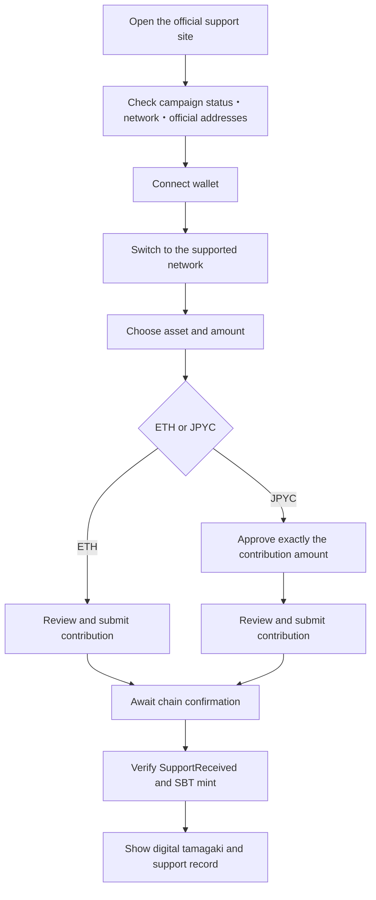

# From wallet contribution to Tamagaki SBT

This chapter defines the experience for a supporter using MetaMask or another EVM wallet, from opening the support site through verifying ownership of a Tamagaki SBT. The interface may evolve, but users must understand what they are connecting, authorizing, sending, and receiving before signing.

::: warning This is currently a testnet demo
Sepolia ETH and MockJPYC have no monetary value, and production fundraising has not started. Never enter a private key or Secret Recovery Phrase into this site, a faucet, or a message to another person.
:::

  

    DEMO IS LIVE ON SEPOLIA
    <strong>The testnet prototype is available</strong>
    
Chain ID 11155111 · Deployment block 11395458

  

  

    <a href="../demo">Open support demo</a>
    <a href="./demo-status">View contracts, SBTs, and totals</a>
  

### Connected contracts

Before signing, confirm that the destination shown by MetaMask matches the relevant Sepolia demo address below.

| Purpose | Contract address |
|---|---|
| Contribution Vault | [`0x6B8BE5103712368fe276499393B53DC26e805c1C`](https://sepolia.etherscan.io/address/0x6B8BE5103712368fe276499393B53DC26e805c1C) |
| MockJPYC | [`0x2d61d67cBe34208b524980F815358184858ba80f`](https://sepolia.etherscan.io/address/0x2d61d67cBe34208b524980F815358184858ba80f) |
| Tamagaki SBT | [`0xC2D1fAC9517544A839D35e67008c76A1839366aA`](https://sepolia.etherscan.io/address/0xC2D1fAC9517544A839D35e67008c76A1839366aA) |

MockJPYC is not official JPYC; it is a valueless test token used only by this prototype. See the [demo data page](./demo-status.md) for all five deployed contracts.

## Beginner setup

### Step 1. Install and open MetaMask

Install MetaMask from the [official download page](https://metamask.io/download/), create or open a wallet, and select a test-only account. Avoid using an account that holds real assets. Store the Secret Recovery Phrase offline or in a trusted secure location; this demo never requests it.

### Step 2. Enable Sepolia

1. Open MetaMask and select Networks.
2. Enable “Show test networks” at the bottom of the network list.
3. Select `Sepolia`.
4. Confirm that the active network is Sepolia; its chain ID is `11155111`.

Sepolia is normally built into MetaMask, so no custom RPC is required. See [MetaMask's official testnet instructions](https://support.metamask.io/configure/networks/how-to-view-testnets-in-metamask/) if the menu differs.

### Step 3. Copy the public address

Copy the selected account address beginning with `0x`. This public address, normally 42 characters long, is the faucet destination. Never paste a 64-digit private key or a Secret Recovery Phrase into a faucet.

### Step 4. Obtain Sepolia ETH

1. Open the [official Ethereum list of Sepolia faucets](https://ethereum.org/developers/docs/networks/#sepolia).
2. Select a listed provider such as Alchemy, Google Cloud, Infura, or QuickNode.
3. Confirm that the selected network is Ethereum Sepolia.
4. Paste only the public account address and request test ETH.
5. Save the transaction hash and wait for confirmation.

Provider login requirements, cooldowns, and daily limits differ. If one provider rejects the request, read its stated condition and try another provider from the official list. Stop immediately if a page asks for a private key, recovery phrase, real funds, unlimited token approval, or NFT `setApprovalForAll`.

### Step 5. Verify receipt

Check the ETH balance while MetaMask is set to Sepolia. If it does not update, search the public address on [Sepolia Etherscan](https://sepolia.etherscan.io/). An incoming transaction and balance in the explorer confirm receipt even if the wallet display is delayed.

### Step 6. Open the interactive demo

After confirming a Sepolia ETH balance, open the [Ethereum Sepolia support demo](../demo.md). Connect the test account, obtain MockJPYC, enter an ETH or MockJPYC amount, review each MetaMask prompt, and verify the resulting transaction and Tamagaki SBT token ID in the explorer. The MockJPYC faucet transaction also requires a small amount of Sepolia ETH for gas.

After the contribution transaction completes, open the [contracts, SBT, and contribution totals page](./demo-status.md). It lists the issued SBT number, owner wallet, contribution asset and amount, and the corresponding Etherscan transaction.

| Problem | Check |
|---|---|
| Sepolia is missing | Enable “Show test networks” |
| Faucet rejects the request | Confirm Ethereum Sepolia and provider cooldown or login requirements |
| ETH is not visible | Confirm the selected network and check Etherscan |
| Demo will not connect | Unlock MetaMask and permit the site connection |
| Insufficient gas | Confirm the Sepolia ETH balance is not zero |
| MockJPYC is missing | Check the faucet transaction and refresh the demo balance |

## Experience principles

- Explain wallet connection, token approval, and contribution as separate actions.
- Before every signature, show the network, asset, amount, gas estimate, and destination contract.
- Default a JPYC allowance to the contribution amount; never require unlimited approval.
- Mint the Tamagaki SBT in the contribution transaction without a separate claim signature.
- Distinguish wallet confirmation, pending, on-chain success, and finalized aggregation.
- Treat explorer ownership as authoritative even when a wallet does not display the image.

Connecting a wallet lets the site see the selected public address; it does not by itself let the site move assets. Moving an ERC-20 requires a separate approval, consistent with [MetaMask's connection guidance](https://support.metamask.io/more-web3/dapps/why-am-i-being-asked-to-connect-to-a-dapp/).

## End-to-end journey

## 0. Before contributing

The site tells the user which EVM wallets are supported, the official domain, network and chain ID, required balances, and whether the campaign is production or a valueless testnet demonstration. ETH contributions require enough ETH for both the amount and gas. JPYC contributions require JPYC plus the network's gas asset.

The demo identifies Ethereum Sepolia, test ETH, and MockJPYC at the top of the page and before signing. Production addresses for the network, Vault, and official JPYC must also be verifiable through independent official channels.

## 1. Connect the wallet

After the user selects “Connect wallet,” MetaMask asks which account may be exposed to the site. The site then shows the shortened address, current network, and relevant balances. No signature or transfer occurs at this stage.

If the network is unsupported, the site displays the expected chain name and chain ID and requests a switch. A network-add request exposes the RPC URL and block explorer for review. The site requests no unnecessary account information and provides a disconnect route.

## 2. Enter contribution details

The supporter selects ETH or JPYC, an amount, and optional public name, country or region, and message. Anonymous or private display remains available. Asset quantities and indicative yen values are visually separated; an indicative value is not the prefecture's confirmed receipt amount. Production keeps optional text in withdrawable off-chain storage. In the image-enabled Sepolia demo, the supporter edits the display name, dedication message, and amount visibility, reviews the Tamagaki preview, and explicitly consents to permanent on-chain publication before sending.

## 3-A. Contribute ETH

ETH normally requires one transaction confirmation:

1. The site shows the amount, estimated gas, and Vault address.
2. MetaMask shows the contract interaction and value.
3. The user checks the network, amount, and destination and confirms.
4. The image-enabled demo calls `supportNativeWithMetadata` to record the contribution and mint the SBT in the same transaction; the legacy flow uses `supportNative`.

Rejecting the wallet prompt sends nothing. Because a successful on-chain transaction is generally irreversible, the final review emphasizes the value and contract address.

## 3-B. Contribute JPYC

JPYC, as an ERC-20, normally requires two transaction confirmations:

1. **Allowance:** approve the Vault to access exactly the intended contribution amount.
2. **Contribution:** the image-enabled demo calls `supportERC20WithMetadata`, moving JPYC to the Vault and minting the SBT; the legacy flow uses `supportERC20`.

The approval view identifies the token, Vault, and allowance. The default allowance equals the contribution and the site never requests unlimited approval or `setApprovalForAll`. MetaMask describes token approval as permission for a contract to access a specified token amount. See [MetaMask's token approval guide](https://support.metamask.io/stay-safe/safety-in-web3/what-is-a-token-approval/).

If approval succeeds but contribution is cancelled or fails, the JPYC stays in the wallet, although allowance may remain. The site shows the current allowance and offers either retry or revoke.

## 4. Pending and completion states

| State | Meaning | Interface response |
|---|---|---|
| Awaiting wallet | The user has not confirmed | Ask the user to review the wallet |
| Submitted and pending | Broadcast but below finality threshold | Show hash and pending status |
| On-chain success | `SupportReceived` and SBT mint detected | Show support ID, token ID, and explorer link |
| Finalized aggregation | Required confirmations reached | Show when finalized totals were updated |
| Rejected or failed | Rejection, insufficient balance or gas, pause, or revert | Explain the cause and safe recovery |

The transaction hash makes status recoverable after closing the page. Pending transactions may support speed-up or cancellation; a confirmed transaction cannot normally be reversed. See [MetaMask's transaction guide](https://support.metamask.io/manage-crypto/tokens/user-guide-transactions-and-failed-transactions/).

## 5. Verify the Tamagaki SBT

A successful contribution transaction establishes the `supportId`, asset and amount, supporter address, SBT `tokenId`, owner, and initial `Received` status. The completion view offers “View tamagaki,” “Verify in explorer,” and “Copy support ID.”

The SBT is non-transferable and represents no sale value, repayment right, tax benefit, or investment return. Receiving it requires no additional signature, seed phrase, private key, or separate fee.

MetaMask may not automatically display the SBT image. Minting is still complete when the SBT contract, token ID, and owner match in the block explorer. The site provides the contract address and token ID for manual import when required. See [MetaMask's NFT display and verification guide](https://support.metamask.io/manage-crypto/nfts/nft-tokens-in-your-metamask-wallet/).

## 6. Recovery from errors

| Error | Asset state | Guidance |
|---|---|---|
| Connection rejected | Unchanged | Reconnect or continue read-only |
| Network switch rejected | Unchanged | Show manual switching instructions |
| Insufficient balance or gas | Unchanged | Show required balance and testnet faucet or funding route |
| JPYC approval rejected | Unchanged | Explain approval and allow retry |
| Contribution fails after approval | JPYC remains; allowance may remain | Retry or revoke allowance |
| Pending transaction | Not finalized | Preserve hash and offer status, speed-up, or cancellation guidance |
| Reverted transaction | No contribution or SBT; gas may be spent | Explain revert and retry conditions |
| SBT media missing | It may still be minted | Verify ownership in explorer and offer manual import |

## 7. Anti-phishing information

The site and wallet let the user cross-check the official domain, chain and chain ID, Vault and JPYC contracts, amount, JPYC allowance, and estimated gas. This system never requests a seed phrase, private key, separate SBT receiving fee, or NFT `setApprovalForAll`. Any page requesting them to receive a Tamagaki SBT must be treated as fraudulent.

## Demo and production

| Item | Ethereum Sepolia demo | Production candidate |
|---|---|---|
| Assets | Test ETH and valueless MockJPYC | Approved ETH and official JPYC |
| Purpose | Validate signing, transfer, and SBT minting | Formal recovery support intake |
| SBT | Test Tamagaki SBT | Production Tamagaki SBT |
| Recipient | Demo address | Kumamoto-designated recipient |
| Tax treatment | No benefit | No benefit under this project |

Do not send real assets before the production campaign is formally announced, regardless of wallet choice.
