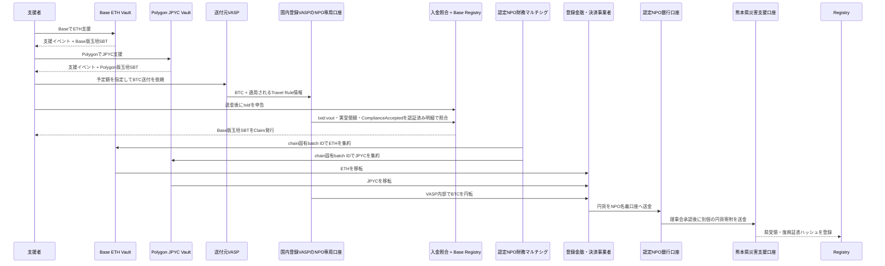

# 3. 支援と資金フロー

## 支援受付

国外支援者はBase MainnetのETH VaultへETH、Polygon PoSのJPYC Vaultへ公式JPYCを送れます。初期本番のBitcoinは、支援Intentを作成したうえで送付元VASPから国内登録VASPの認定NPO専用受取口座へNative BTCを送ります。VASPがTravel Rule、AML／CFT・制裁審査、custody、円転を担当し、`ComplianceAccepted`入金の照合後にBaseでSBTを発行します。自己管理Bitcoin addressとLightning invoiceは初期本番では無効とし、ADR-0011〜0014の条件を満たした後に追加します。

国、表示名、メッセージは任意です。国はウォレットやIPアドレスから推定せず、本人の申告だけを集計します。

## 集約と熊本県への移転

コントラクト、DAO、認定NPOは交換業務を行いません。EVMは受領時、Bitcoinは国内登録VASPによる確認・コンプライアンス審査後の`ComplianceAccepted`時に支援金として会計処理し、支援者別残高、交換、振替を提供しません。初期本番のBTCはVASPがcustody・円転し、円貨を認定NPO銀行口座へ送金します。NPOは理事会承認後に熊本県へ別個の円貨寄附を行い、県への直接暗号資産寄附とは表示しません。NPO管理hardware multisigとLNDは将来経路であり、初期本番には含めません。

## Bitcoin確認モデル

初期本番のNative Bitcoinは`IntentCreated → TravelRuleAccepted / Held / Rejected → DepositDetected → Confirmed → ComplianceAccepted / Held / Rejected → SBTIssued → Converted → BankRemitted`を分離し、0-confirmationまたは審査中の入金を確定集計へ含めません。送金前Intentにはtxidを含めず、送金後に検証者がbeneficiary VASPの認証済み明細とpublic chainを突合し、`txid:vout`、実受領額、確認blockをAttestationへ拘束します。公開RegistryへPIIやVASP内部IDを載せず、同一outpointから複数SBTを発行しません。Lightningは将来経路として`Settled → ComplianceReview → Accepted / Held / Rejected`を使用します。

## 会計上の表示

公開画面では、資産別数量、ETH参考評価額、円転時の確定円貨額、熊本県への送金済み額、処理中額、残高、手数料を分離します。

資産数量と円転後の円貨を同じ式へ混在させません。資産・経路ごとの整合式は次のとおりです。

$$
R_a = B_a + X_a + F_a + A_a
$$

ここで、$R_a$は資産$a$の確定受領量、$B_a$は未集約残高、$X_a$は登録事業者へ移転済み量、$F_a$は資産建て明示手数料、$A_a$は訂正差額です。円転batchは別に`円転総額 = 県送金済み円額 + 円貨処理中額 + 円建て明示手数料`で照合します。参考評価額を確定受領額として表示しません。

## 受領証跡

銀行証憑や行政文書そのものは公開チェーンへ置かず、文書ハッシュ、バッチID、円建て確定額、確認時刻を記録します。利用者は公開文書をハッシュ化し、オンチェーン記録と一致するか検証できます。
