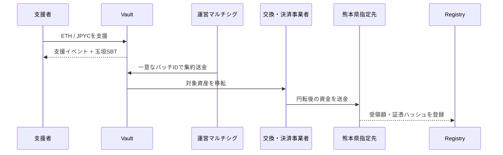

# 3. 支援と資金フロー

## 支援受付

支援者は許可されたチェーンでETHまたは公式JPYCを送ります。コントラクトはゼロ金額、未許可資産、停止中の受付を拒否し、支援IDと受付イベントを発行します。

国、表示名、メッセージは任意です。国はウォレットやIPアドレスから推定せず、本人の申告だけを集計します。

## 集約と熊本県への移転

コントラクトは交換業務を行いません。ETH・JPYCの円転や銀行送金は、必要な登録・管理態勢を備えた事業者が担当する前提です。

## 会計上の表示

公開画面では、資産別数量、ETH参考評価額、円転時の確定円貨額、熊本県への送金済み額、処理中額、残高、手数料を分離します。

基本整合式は次のとおりです。

$$
R = K + P + B + F
$$

ここで、$R$ は受領額、$K$ は熊本県への送金済み額、$P$ は処理中額、$B$ は残高、$F$ は明示手数料です。参考評価額を確定受領額として表示しません。

## 受領証跡

銀行証憑や行政文書そのものは公開チェーンへ置かず、文書ハッシュ、バッチID、円建て確定額、確認時刻を記録します。利用者は公開文書をハッシュ化し、オンチェーン記録と一致するか検証できます。
