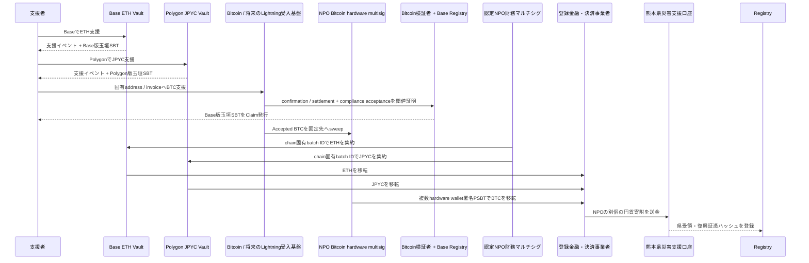

# 3. 支援と資金フロー

## 支援受付

国外支援者はBase MainnetのETH VaultへETH、Polygon PoSのJPYC Vaultへ公式JPYCを送るほか、支援Intentごとの固有Bitcoin addressからNative BTCを送れます。EVM Vaultは同じchainで玉垣SBTを原子的に発行します。Native Bitcoinは確認と閾値アテステーション後にBaseでSBTを発行します。Lightning invoice経路も同じ非原子的モデルを使いますが、初期本番では無効とし、ADR-0011・0012・0013の鍵、流動性、法務・コンプライアンス条件を満たした後に追加します。

国、表示名、メッセージは任意です。国はウォレットやIPアドレスから推定せず、本人の申告だけを集計します。

## 集約と熊本県への移転

コントラクト、Bitcoin受入基盤、DAOは交換業務を行いません。EVMは受領時、Bitcoin／Lightningは確認・コンプライアンス審査後のAccepted時に資産を認定NPOの支援金として会計処理し、支援者別残高、交換、振替を提供しません。Accepted BTCの長期保管は認定NPO管理のBitcoin hardware multisigを必須とし、LNDには有限なchannel運用資金だけを置きます。NPOは必要な登録・管理態勢を備えた事業者を介してETH、JPYC、BTCを円転し、熊本県へ別個の円貨寄附を行います。県への直接暗号資産寄附とは表示しません。

## Bitcoin確認モデル

Native Bitcoinは`Detected → Confirmed → ComplianceReview → Accepted → SBTIssued`を分離し、0-confirmationを確定集計へ含めません。Lightningは`Settled → ComplianceReview → Accepted / Held / Rejected`を分離します。公開Registryにはdomain-separated commitmentを登録し、同一`txid:vout`またはpayment commitmentから複数SBTを発行しません。詳細は[ADR-0011](./adr/0011-bitcoin-lightning-and-base-sbt)と[ADR-0013](./adr/0013-lightning-legal-classification-and-abuse-controls)を参照してください。

## 会計上の表示

公開画面では、資産別数量、ETH参考評価額、円転時の確定円貨額、熊本県への送金済み額、処理中額、残高、手数料を分離します。

資産数量と円転後の円貨を同じ式へ混在させません。資産・経路ごとの整合式は次のとおりです。

$$
R_a = B_a + X_a + F_a + A_a
$$

ここで、$R_a$は資産$a$の確定受領量、$B_a$は未集約残高、$X_a$は登録事業者へ移転済み量、$F_a$は資産建て明示手数料、$A_a$は訂正差額です。円転batchは別に`円転総額 = 県送金済み円額 + 円貨処理中額 + 円建て明示手数料`で照合します。参考評価額を確定受領額として表示しません。

## 受領証跡

銀行証憑や行政文書そのものは公開チェーンへ置かず、文書ハッシュ、バッチID、円建て確定額、確認時刻を記録します。利用者は公開文書をハッシュ化し、オンチェーン記録と一致するか検証できます。
