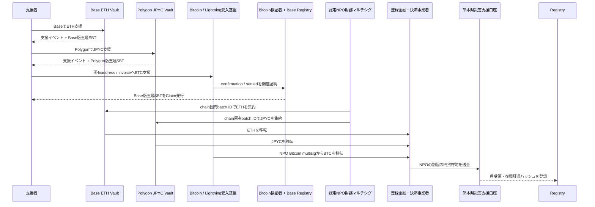

# 3. 支援と資金フロー

## 支援受付

国外支援者はBase MainnetのETH VaultへETH、Polygon PoSのJPYC Vaultへ公式JPYCを送るほか、支援Intentごとの固有Bitcoin addressまたはLightning invoiceからBTCを送れます。EVM Vaultは同じchainで玉垣SBTを原子的に発行します。Bitcoin／Lightningは確認と閾値アテステーション後にBaseでSBTを発行します。

国、表示名、メッセージは任意です。国はウォレットやIPアドレスから推定せず、本人の申告だけを集計します。

## 集約と熊本県への移転

コントラクト、Bitcoin受入基盤、DAOは交換業務を行いません。支援成立時に資産は認定NPOへ確定的に帰属し、支援者別残高、交換、振替を提供しません。NPOは必要な登録・管理態勢を備えた事業者を介してETH、JPYC、BTCを円転し、熊本県へ別個の円貨寄附を行います。県への直接暗号資産寄附とは表示しません。

## Bitcoin確認モデル

Native Bitcoinは`Detected → Confirmed → Accepted → SBTIssued`を分離し、0-confirmationを確定集計へ含めません。Lightningは一回限りのinvoiceがsettledになったことをpayment hashで確認します。単一backendではなく複数Bitcoin nodeの閾値アテステーションをBase Registryへ登録し、同一`txid:vout`または`paymentHash`から複数SBTを発行しません。詳細は[ADR-0011](./adr/0011-bitcoin-lightning-and-base-sbt)を参照してください。

## 会計上の表示

公開画面では、資産別数量、ETH参考評価額、円転時の確定円貨額、熊本県への送金済み額、処理中額、残高、手数料を分離します。

基本整合式は次のとおりです。

$$
R = K + P + B + F
$$

ここで、$R$ は受領額、$K$ は熊本県への送金済み額、$P$ は処理中額、$B$ は残高、$F$ は明示手数料です。参考評価額を確定受領額として表示しません。

## 受領証跡

銀行証憑や行政文書そのものは公開チェーンへ置かず、文書ハッシュ、バッチID、円建て確定額、確認時刻を記録します。利用者は公開文書をハッシュ化し、オンチェーン記録と一致するか検証できます。
