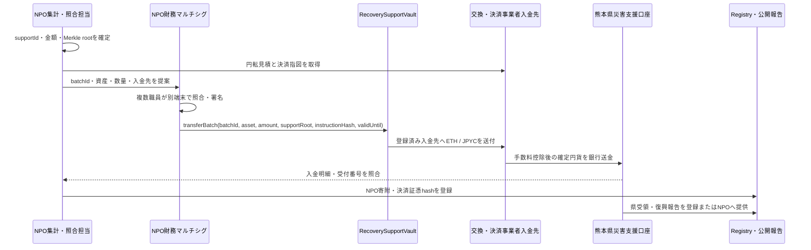

# 認定NPO・熊本県向け運用ビュー

このページは、熊本県、法的運営主体となる認定NPO、登録金融・決済事業者との協議に使う運用案です。初期の本番候補ではNPOがVaultと財務マルチシグを管理し、熊本県職員は原則としてVault送金鍵を持たず、円貨の受納と県側報告を担います。現時点の正式な熊本県手続、承認、口座指定または特定NPOとの提携を示すものではありません。

## 資金移転の全体像

スマートコントラクトから銀行口座へ直接送金することはできません。オンチェーン資産と円貨の境界を、登録・契約済みの交換・決済事業者が担当します。



## 1. 役割を先に分離する

一人の職員や一つのウォレットへ全権限を集めません。

| 役割 | 主な操作 | 保有してはならない権限 |
|---|---|---|
| NPO設定管理 | 許可資産、事業者入金先、ロール変更 | 日常の単独送金 |
| NPO財務署名者 | 理事会等で承認された送金バッチの確認と署名 | 送金先の単独変更 |
| 緊急停止 | 異常時の`pause` | 停止解除、資金送金 |
| 照合担当 | 集計、見積、銀行入金、証憑の照合 | オンチェーン署名 |
| NPO報告担当 | 決済証憑と県原本を照合しRegistryへ登録 | Vault資金移動 |
| 熊本県担当 | 円貨受納、県受領確認、復興事業・支出結果の原本提供 | Vault管理・円転 |
| 監査担当 | ログ、証憑、残高、不変条件の検査 | 設定変更、署名 |

デモでは同一アカウントを使えますが、本番では禁止します。DAO参考投票の鍵へ、管理・財務・停止・報告ロールを付与しません。

## 2. 職員ウォレットの初期設定

### 機器とアカウント

1. 認定NPOが管理する専用端末と、法人購入・資産管理されたハードウェアウォレットを各署名者へ割り当てる。県が将来公式収納モデルを採用しない限り、県職員をVault署名者にしない。
2. 日常利用、個人保有資産、テストネット、本番のアカウントを分離する。本番署名端末へ私物ウォレットを接続しない。
3. ハードウェアウォレット本体で新しいseedを生成する。seed、秘密鍵、PINをWebページ、MetaMask、チャット、メール、クラウド、写真、パスワード管理ソフトへ入力しない。
4. 復旧情報は改ざん・水濡れ・火災に耐える媒体へ記録し、封印番号付きで二か所の物理保管庫へ分散する。保管庫へのアクセス記録を残す。
5. MetaMask等は署名内容を表示するインターフェースとしてだけ利用し、配布元、拡張機能ID、更新手続を組織で固定する。
6. 採用チェーン、Chain ID、公式RPC、block explorer、Vault、許可資産、マルチシグのアドレスを、運用台帳と読み取り専用ポータルへ登録する。
7. 公開アドレスを二人で読み合わせ、別経路のQRコードと文字列で照合する。少額のテストネット送受信と署名訓練を完了してから本番owner候補とする。

### 初期設定の完了条件

- seedと秘密鍵がオンライン環境へ露出していない
- 各署名者の本人、端末、ハードウェアウォレット、公開アドレスを台帳で対応付けた
- 紛失、異動、死亡・長期不在、端末感染時の連絡先と停止手順を確認した
- 本番ネットワークでの操作前に、同じ手順をテストネットで二回以上成功させた

## 3. マルチシグの生成

本番候補では、十分に監査されたSafe型マルチシグを利用し、財務用と設定管理用を分けます。製品とバージョンは外部監査と県の審査後に確定します。

1. 署名者候補、代替署名者、必要署名数を文書で承認する。例として5名中3名の`3-of-5`は、一名の不在と一名の鍵喪失に耐えられますが、人数はリスク評価で確定する。
2. 検証済みの公式URLとコントラクトを二人で確認し、対象ネットワークを固定する。
3. 各ownerのアドレスを別の原本から入力し、氏名ではなくアドレス全文を複数人で照合する。
4. 閾値を設定し、マルチシグを作成する。作成transaction、Safeアドレス、owner一覧、閾値、実装バージョンを保存する。
5. 読み取り専用端末でもownerと閾値をオンチェーン照合する。ブラウザ画面の表示だけを証拠にしない。
6. 少額で「提案、別端末での照合、複数署名、実行、取消、署名者不在」を訓練する。
7. `TREASURER_ROLE`を財務マルチシグへ、`DEFAULT_ADMIN_ROLE`を設定管理マルチシグまたはタイムロックへ付与する。個人EOAに残ったロールを削除したことを確認する。

マルチシグowner変更、閾値低下、module追加、guard変更は通常送金より高リスクです。タイムロック、二重承認、公開予告を要求し、緊急時を除いて即時実行しません。

## 4. 鍵管理と日常運用

- 署名者は同じ部屋や同じオンライン会議の指示だけで一斉署名しない。独立した業務資料と別経路の連絡で内容を確認する。
- 署名前にハードウェアウォレット本体で、network、Vault、呼出関数、asset、amountを確認する。画面にdecodeできないdataが出た場合は中止する。
- seedを復元する訓練は本番鍵で行わず、同型の訓練専用鍵を使う。
- 四半期ごとにowner、ロール、端末、保管庫アクセス、拡張機能、RPC、事業者入金先を棚卸しする。
- 人事異動前に後任鍵を追加し、独立確認後に旧鍵を削除する。閾値を一時的に`1-of-N`へ下げない。
- 紛失・盗難・マルウェア・誤署名の疑いがあれば新規送金を停止し、未実行transactionを破棄し、緊急停止、owner交換、影響調査、対外報告を順に実施する。

## 5. 交換・決済事業者と口座の事前登録

送金開始前に、熊本県と認定NPOは次を二つ以上の経路で照合し、NPOの承認済み台帳へ登録します。

- 事業者の法人、登録・許認可、契約番号、対応チェーンと資産
- 事業者が指定するオンチェーン入金アドレスと、memo/tagの要否
- 円転手数料、network fee、見積期限、最低・最大取扱額、着金SLA
- 円貨の振込先が熊本県の書面で指定した「熊本県災害支援口座」であること
- 口座名義、金融機関、支店、口座種別、口座番号を扱う非公開台帳と変更承認手続
- 誤チェーン、未対応token、事業者障害、組戻し、入金保留時の連絡手順

銀行口座情報は公開チェーンへ書きません。公開するのは、口座指定書や決済指図書のhash、事業者受付番号、確定円貨額、受領時刻など、口座番号を復元できない証跡です。

## 6. Vaultから熊本県災害支援口座へ移す手順

### A. バッチを作る

1. 最終確定ブロックを決め、その時点までの未処理`SupportReceived`を資産別に抽出する。
2. `supportId`の重複・欠落を検査し、件数、総受領量、過去送金量、Vault残高を照合する。
3. 対象`supportId`からMerkle rootを作り、前バッチhashと結んだ一意な`batchId`を生成する。
4. 事業者から、対象資産、数量、登録済み入金先、手数料、確定予定円貨、見積期限、熊本県災害支援口座への振込指図を取得する。
5. バッチ明細、決済指図、県の口座指定書についてhashを作り、原本はアクセス制御された文書基盤へ保存する。

### B. マルチシグで提案・署名する

1. 財務マルチシグからVaultの次の呼出しを提案する。

```text
transferBatch(batchId, asset, amount, supportRoot, instructionHash, validUntil)
```

2. 提案者以外の照合担当が、`batchId`、asset、amount、Vault残高、事業者入金先、見積期限、手数料、予定円貨を原本と照合する。
3. 各署名者は別端末で同じ項目を確認する。アドレスは先頭・末尾だけでなく全文または検証済みアドレス帳で確認する。
4. 閾値を満たしても、見積期限切れ、事業者の保守、chain congestion、残高変化があれば実行せず、バッチを取消または後継バッチとして作り直す。
5. 初回、事業者変更後、入金先変更後は必ず少額バッチを先に実行し、オンチェーン着金と銀行入金を確認してから本送金する。

### C. 円転・銀行着金を照合する

1. `BatchTransferred`のtransaction hash、block、asset、amount、beneficiaryを記録する。
2. 事業者のオンチェーン入金と受付番号を確認し、見積または約定レート、手数料、確定円貨額を取得する。
3. 熊本県災害支援口座の入金明細で、振込名義、金額、日付、事業者受付番号を照合する。
4. 次式が許容差内で成立することを確認する。

$$
受領資産の円転額 = 熊本県災害支援口座への入金額 + 開示手数料 + 未処理差額
$$

5. transaction、バッチ明細、事業者約定、銀行入金明細を一つの監査パッケージへまとめ、二人が完了承認する。
6. NPOが`RecoveryAttestationRegistry`へbatch ID、確定円貨額、受領時刻、公開可能な証憑hashを記録する。熊本県による受領確認・復興報告は県自身または正式な委任に基づいて追記し、支援者向け画面へ反映する。

## 7. 現在のプロトタイプとの差

強化版プロトタイプは、バッチごとのMerkle root、決済指図hash、実行期限、資産別上限、および`beneficiary`変更の提案・2日待機・実行をオンチェーンで拘束します。ただし、supportIdが重複なくrootへ含まれることの生成・検証、銀行送金、事業者見積、組織マルチシグ、管理ロール自体のtimelockは運用基盤側に残ります。

本番では、`beneficiary`を熊本県災害支援口座そのものと表現してはいけません。これは交換・決済事業者の登録済みオンチェーン入金先です。そのアドレスと熊本県災害支援口座への振込指図を、契約と検証可能な証憑で一対一に結びます。事業者が入金ごとに異なるアドレスを発行する場合、現行の単一`beneficiary`設計では不足するため、許可済み決済先と指図hashを扱うSettlement Router等の追加設計が必要です。

初期のNPO主体モデルでは、オンチェーン資産は支援成立時にNPOへ帰属し、事業者による円転後の銀行送金はNPOから熊本県への別個の円貨寄附です。県への直接JPYC寄附、県によるJPYC保管、支援者資産の預りとは表示しません。詳細は[ADR-0008](./adr/0008-certified-npo-joint-operation)に従います。

## 実行前チェックリスト

- [ ] 本番受付開始が正式承認されている
- [ ] Vault、資産、chain、事業者入金先を二経路で確認した
- [ ] 熊本県災害支援口座の指定書と名義を確認した
- [ ] `batchId`、Merkle root、件数、asset、amountを照合した
- [ ] 見積期限、確定予定円貨、手数料を確認した
- [ ] マルチシグ署名者が独立して確認した
- [ ] 初回・変更後の少額疎通試験を完了した
- [ ] オンチェーン着金、円転、銀行入金を照合した
- [ ] 証憑hashと公開情報から口座番号等を復元できない
- [ ] Registryと支援者向け画面へ受領結果を反映した

## 事故・誤操作時の初動

1. 不明な署名、送付先差異、会計不一致、端末感染、鍵紛失を発見した職員は、責任追及より先に新規提案と実行を停止する。
2. 緊急停止担当が影響対象Vaultをpauseし、最終正常block、batch、残高、未実行Safe transactionを保存する。
3. 未実行transactionを破棄し、RPC、Web UI、事業者画面を信用せず、別の読み取り専用環境からchain状態を確認する。
4. 鍵侵害ならowner交換、誤入金先なら事業者への凍結依頼、誤attestationなら取消・後継記録を準備する。
5. 事実、既知の影響、停止状態、次回更新時刻を公表する。推測を確定情報として掲載しない。
6. 原因除去、残高照合、外部確認、再発防止、別マルチシグ承認が完了するまでunpauseしない。

関連する設計判断は[ADR-0003](./adr/0003-fund-governance-and-custody)、[ADR-0006](./adr/0006-security-boundaries-and-verifiable-batches)、[ADR-0007](./adr/0007-threat-model-and-human-error-controls)、[ADR-0008](./adr/0008-certified-npo-joint-operation)を参照してください。
