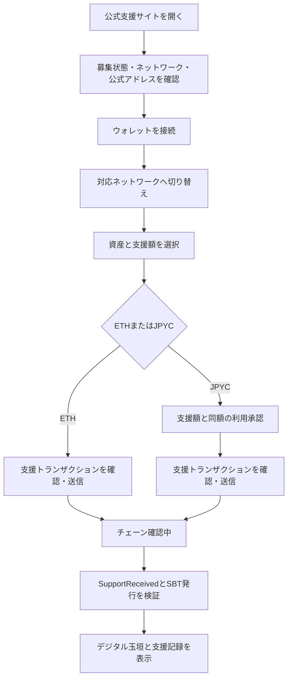

# ウォレットから支援し、玉垣SBTを受け取る体験

この章では、MetaMaskなどのEVMウォレットを利用する支援者が、支援サイトを開いてから玉垣SBTを確認するまでのユーザー体験を定義します。画面の文言や配置は変更できますが、利用者が「何を許可し、何を送信し、何を受け取るか」を署名前に理解できることを必須とします。

## 体験の原則

- ウォレット接続、トークン利用承認、支援送信を別の操作として説明する。
- すべての署名前に、ネットワーク、資産、金額、ガス代、接続先コントラクトを表示する。
- JPYCの利用承認額は支援額と同額を初期値とし、無制限承認を要求しない。
- 玉垣SBTは支援トランザクション内で自動発行し、別の「受取」「Claim」署名を要求しない。
- 「処理中」「チェーン上で成功」「必要確認数へ到達」を区別する。
- ウォレットに画像が表示されなくても、ブロックエクスプローラー上の所有記録を正とする。

ウォレットをサイトへ接続しただけでは、サイトが資産を移動できるようにはなりません。ERC-20を移動するには、利用者による別のトークン利用承認が必要です。これは[MetaMaskの接続説明](https://support.metamask.io/more-web3/dapps/why-am-i-being-asked-to-connect-to-a-dapp/)とも一致します。

## 全体のユーザージャーニー

## 0. 支援前の準備

利用者には次を事前に案内します。

- 対応するEVMウォレット
- 正式なサイトURL
- 使用ネットワークとチェーンID
- ETH支援では、支援額とガス代に必要なETH
- JPYC支援では、JPYC残高とガス代に必要なネットワーク通貨
- 本番受付中か、価値を持たないテストネットデモか

デモではBase Sepolia、テストETH、MockJPYCであることを画面上部と署名直前に表示します。本番では公式に合意されたネットワーク、Vault、JPYCコントラクトのアドレスを、サイト以外の公式経路からも確認できるようにします。

## 1. ウォレット接続

利用者が「ウォレットを接続」を押すと、MetaMask等が接続を許可するアカウントを尋ねます。サイトは接続後に短縮アドレス、現在のネットワーク、必要残高を表示します。

この時点では署名も送金も発生しません。サイトは不要なアカウント情報を要求せず、接続解除方法を示します。対応外ネットワークの場合は、正しいチェーン名とチェーンIDを表示して切替を依頼します。ネットワーク追加要求ではRPC URLとブロックエクスプローラーも確認できるようにします。

## 2. 支援内容の入力

利用者は次を選択します。

- 支援資産：ETHまたはJPYC
- 支援額
- 玉垣に表示する名前、国・地域、メッセージ：すべて任意
- 非公開または匿名表示

確認画面では、資産数量と参考円換算を混同させません。参考円換算は価格変動する概算であり、熊本県の確定受領額ではないと表示します。任意公開情報は原文をオンチェーンへ記録せず、公開撤回が可能なオフチェーン情報として扱います。

## 3-A. ETHで支援する場合

ETHでは原則として1回のトランザクション確認です。

1. サイトが支援額、推定ガス代、Vaultアドレスを表示する。
2. MetaMaskがコントラクト呼び出しと送信額を表示する。
3. 利用者がネットワーク、送信額、送信先を再確認して承認する。
4. `supportNative`が支援を記録し、同じトランザクション内で玉垣SBTを発行する。

送信ボタンを押しても、ウォレットで拒否した場合は何も送信されません。チェーン上で成功した取引は原則として取り消せないため、最終確認画面で送信額とコントラクトアドレスを強調します。

## 3-B. JPYCで支援する場合

ERC-20であるJPYCは、通常2回のトランザクション確認が必要です。

1. **利用承認**：Vaultが今回の支援額だけを取得できるよう`approve`する。
2. **支援送信**：`supportERC20`を実行し、JPYCをVaultへ移動してSBTを発行する。

利用承認画面では、対象トークン、承認先Vault、上限額を表示します。初期値は支援額と同額とし、無制限承認や`setApprovalForAll`を要求しません。MetaMaskはトークン承認を、コントラクトが指定量のトークンへアクセスする許可として説明しています。[MetaMaskのトークン承認ガイド](https://support.metamask.io/ja/stay-safe/safety-in-web3/what-is-a-token-approval/)

承認だけ成功し、支援送信を中止または失敗した場合、資金はウォレットに残りますがallowanceが残る可能性があります。サイトは「再試行」「承認を解除」の選択肢と、現在のallowanceを表示します。

## 4. 確認中と完了

送信後は次の状態を区別します。

| 状態 | 意味 | 画面表示 |
|---|---|---|
| ウォレット確認待ち | まだ利用者が承認していない | ウォレットで内容を確認してください |
| 送信済み・確認中 | トランザクションは送信されたが必要確認数前 | トランザクションハッシュ、確認中 |
| チェーン上で成功 | `SupportReceived`とSBT発行を検出 | 支援ID、Token ID、ブロックエクスプローラー |
| 確定集計済み | 所定の確認ブロック数へ到達 | 確定値への反映時刻 |
| 失敗・拒否 | ウォレット拒否、残高不足、ガス不足、コントラクト停止等 | 原因と安全な再試行方法 |

確認中にページを閉じても、トランザクションハッシュから状態を再取得できるようにします。保留中取引はウォレット側で高速化や取消が可能な場合がありますが、チェーン上で成功した取引は取消不能です。[MetaMaskの取引ガイド](https://support.metamask.io/manage-crypto/tokens/user-guide-transactions-and-failed-transactions/)

## 5. 玉垣SBTの獲得確認

支援が成功すると、同じトランザクション内で次が確定します。

- `supportId`
- 支援資産と数量
- 支援者ウォレット
- 玉垣SBTの`tokenId`
- SBT保有者
- 初期状態`Received`

完了画面には「玉垣を見る」「ブロックエクスプローラーで検証」「支援IDをコピー」を表示します。SBTは譲渡不能で、売却、換金、返済請求、税制優遇を表しません。また、受け取るための追加署名、秘密鍵、シードフレーズの入力を要求しません。

MetaMaskでSBTが自動表示されない場合があります。この場合でも、ブロックエクスプローラー上でSBTコントラクト、Token ID、所有アドレスが一致すれば発行は完了しています。必要に応じてSBTコントラクトアドレスとToken IDを使った手動インポート手順を案内します。[MetaMaskのNFT表示・確認方法](https://support.metamask.io/manage-crypto/nfts/nft-tokens-in-your-metamask-wallet/)

## 6. エラー時の回復

| エラー | 資金状態 | 利用者への案内 |
|---|---|---|
| ウォレット接続拒否 | 変化なし | 再接続または閲覧のみで続行 |
| ネットワーク切替拒否 | 変化なし | 手動切替方法を表示 |
| ETH・ガス不足 | 変化なし | 必要残高とfaucetまたは入金方法を表示 |
| JPYC承認拒否 | 変化なし | 承認の意味を説明して再試行 |
| JPYC承認後に支援失敗 | JPYCは残るがallowanceが残る場合あり | 再試行または承認解除 |
| トランザクション保留 | 未確定 | ハッシュを保存し、状態確認・高速化・取消を案内 |
| トランザクションrevert | 送金とSBT発行は成立しない。ガス代は発生し得る | revert理由と再試行条件を表示 |
| SBT画像が見えない | 発行済みの場合がある | Explorerで所有を確認し、手動インポート |

## 7. フィッシング防止表示

サイトとウォレットの双方で、利用者が次を照合できるようにします。

- 正式なドメインと接続中サイト
- チェーン名とチェーンID
- VaultとJPYCの公式コントラクトアドレス
- ETHまたはJPYCの数量
- JPYC承認上限
- 推定ガス代

本システムは、シードフレーズ、秘密鍵、SBT受取手数料の別送、NFTの`setApprovalForAll`を要求しません。SBT発行を名目にこれらを要求する画面は偽物として扱います。

## デモと本番の違い

| 項目 | Base Sepoliaデモ | 本番候補 |
|---|---|---|
| 資産 | テストETH・価値のないMockJPYC | 許可済みETH・公式JPYC |
| 目的 | 署名・送金・SBT発行の技術検証 | 正式な復興支援受付 |
| SBT | テスト用玉垣SBT | 本番玉垣SBT |
| 受領先 | デモ用アドレス | 熊本県が正式指定した受領先 |
| 税制 | 優遇なし | 本構想では優遇なし |

本番開始前は、どのウォレットを使用しても実資産を送信しないでください。
